# Development Log

This log records tested implementation slices as the project moves from the Border Seven Days MVP toward the full game. Each entry should name the behavior that changed and the verification gate used before publishing.

## 2026-06-08

- Added a tested creator draft outline preview. The web GUI now summarizes the generated creator scenario before import, including days, scenes, locations, NPCs, factions, crisis clocks, actions, and endings.
- Captured a runtime screenshot showing the Chinese creator outline on the scenario selection screen:

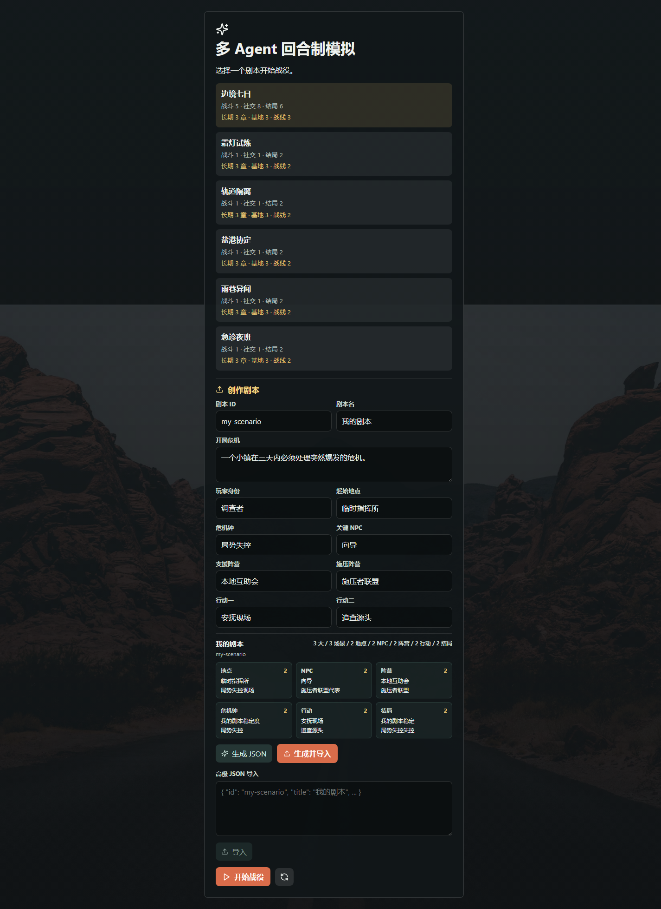

- Verification used for this slice:
  - `npm test -- apps/web/src/creatorScenarioPreview.test.ts apps/web/src/scenarioImport.test.ts --reporter=dot`
  - `npm run typecheck -w apps/web`
  - `npm run typecheck`
  - `npm test -- --reporter=dot`
  - `npm run build`

## 2026-06-07

- Added tested Chinese source/API campaign arc text for Border Seven Days. The Campaign Arc panel now receives `边境危机`, `边境余波`, and `裂隙战线` from scenario metadata instead of rendering the previous English chapter titles.
- Captured a runtime screenshot showing the Border Seven Days chapter panel with Chinese title and focus text:

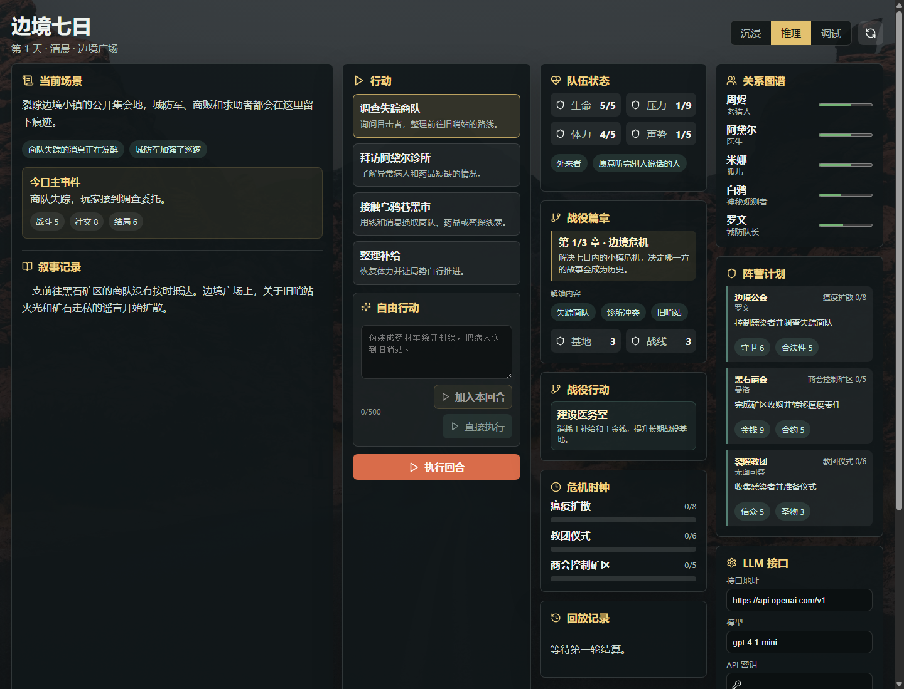

- Added tested source/API-level Chinese referee feedback for freeform player actions. Success and setback chronicle events now use Chinese titles and bodies such as `自由行动推进` / `自由行动受阻`, while still proving player prose is only intent and state changes remain referee-owned.
- Captured a runtime screenshot showing a direct freeform action result with Chinese referee feedback in the visible GUI:

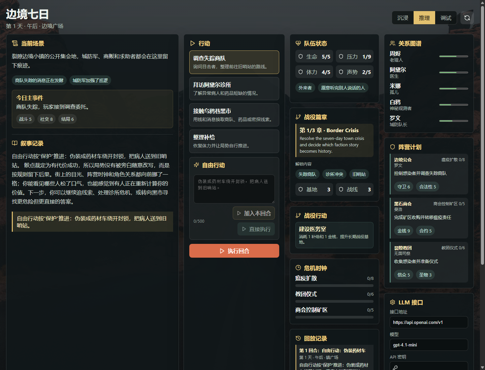

- Added a tested Chinese GUI quick-create path for creator scenarios. The starter form captures scenario id, title, premise, player role, starting location, crisis clock, key NPC, two factions, and two actions, then generates a schema-valid creator scenario draft that can be imported through the existing creator API.
- Captured a runtime screenshot showing the new creator scenario quick-create form on the scenario selection screen:

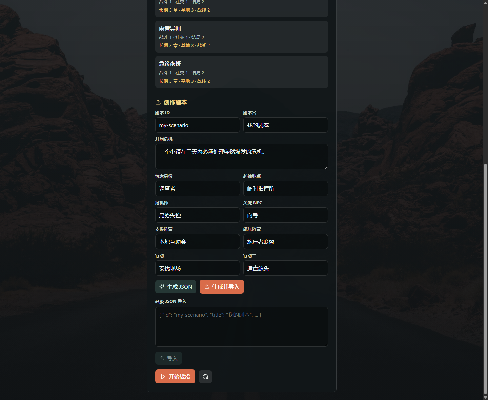

- Added tested source/API-level Chinese text for the first-wave expansion scenario packages. Scenario titles, player-facing day plans, chapter focus text, location/faction/NPC/quest/clock text, fixed action labels, and success/failure endings now come from Chinese content instead of only being translated in the web display layer.
- Captured a runtime screenshot showing a fresh `霜灯试炼` campaign with Chinese source content in the campaign title, current location, scene/event text, and fixed action cards:

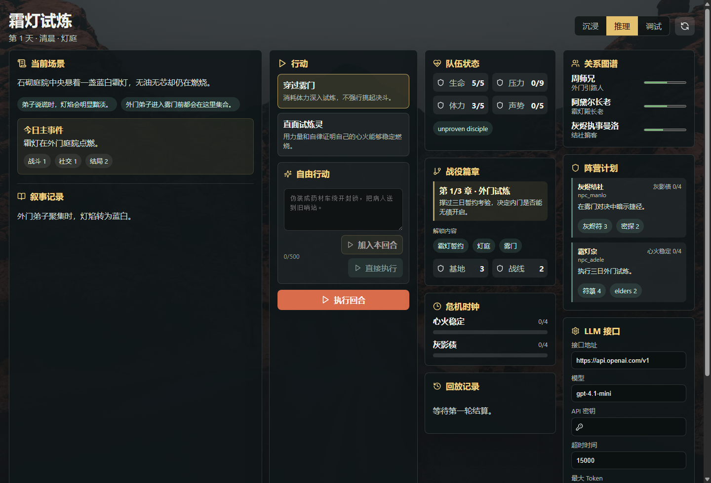

- Added a tested player-action display layer. Built-in action cards and replay titles now render Chinese labels/descriptions in the web GUI and chronicle timeline while the original `PlayerAction` payload still goes to the referee unchanged.
- Captured a runtime screenshot showing localized fixed action cards in an expansion campaign while the freeform composer remains available:

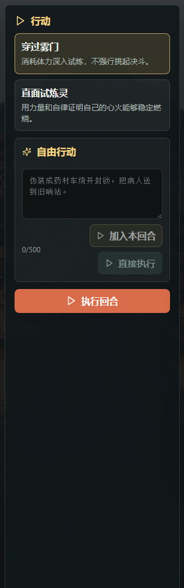

- Added tested long-campaign asset project moves. Ending-inherited assets such as `public_case_archive` now appear as actionable Campaign Moves, are legality-checked by the API, are consumed through referee-owned `StatePatch` records, and update faction fronts plus public chronicle history.
- Captured a runtime screenshot from a real `guild_case` playthrough after `public_case_archive x1` was inherited and surfaced as `Mobilize public case archive`:

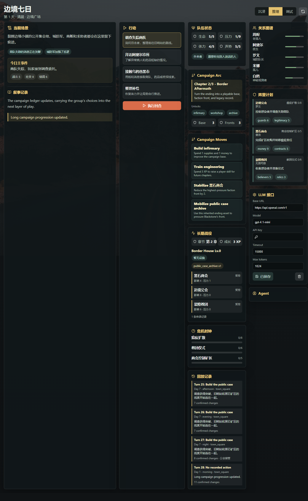

- Added tested freeform player actions. The web action panel now combines fixed action cards with a GUI composer for arbitrary player intent; submitted text becomes a `custom` `PlayerAction`, then the core referee rolls, writes a legal patch, and records a public freeform event without letting the text directly mutate state.
- Captured a runtime screenshot showing the freeform composer, selected custom action, and unified execute button:

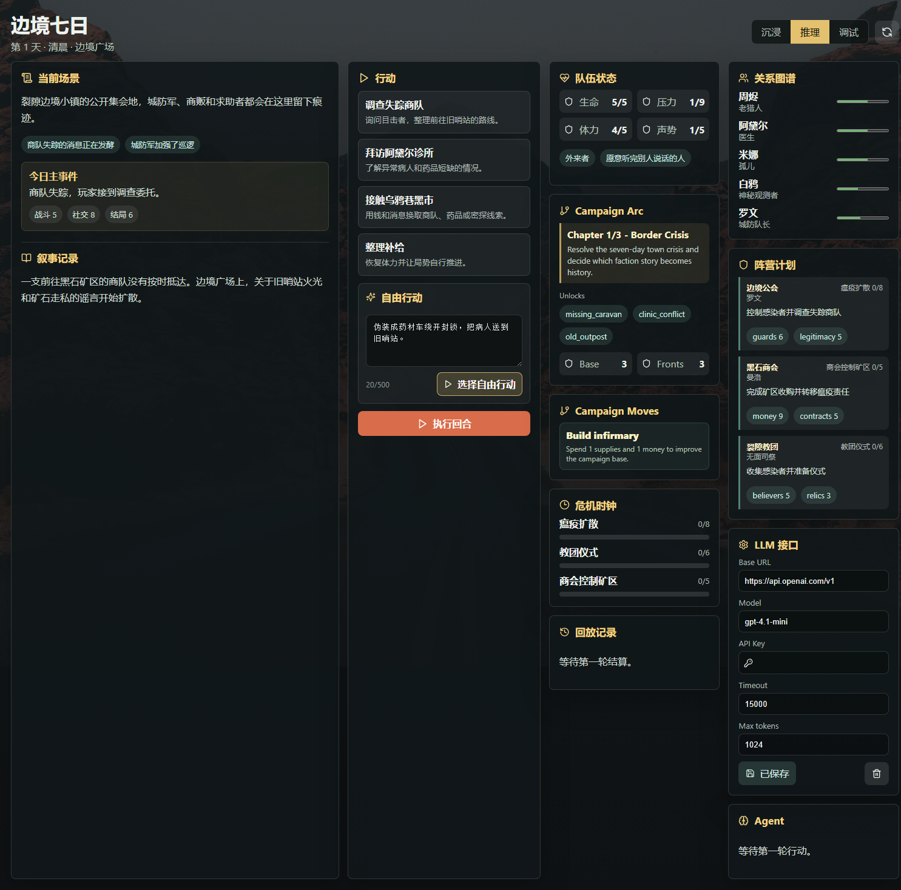

- Extended freeform actions with tested intent inference. The GUI now previews inferred intent, risk, and target chips, and the referee uses `freeform:intent:*` tokens to choose the matching rule channel such as protect using `will/defense` and reducing plague pressure on success.
- Captured a runtime screenshot showing the inferred freeform preview chips:

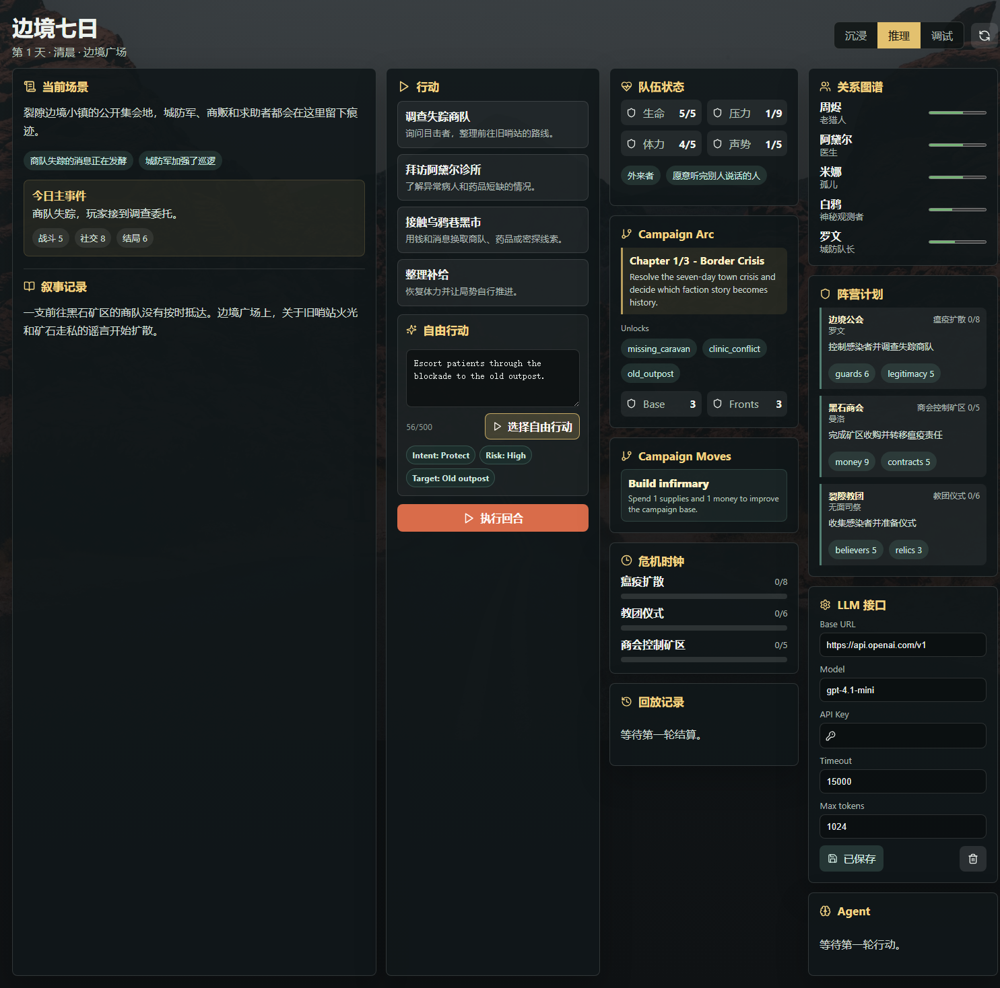

- Added tested direct freeform submission. The action panel now shows Chinese intent/risk/target chips and a `直接执行` button so typed player intent can enter the normal referee turn pipeline without first being converted into a selected fixed card.
- Captured a focused runtime screenshot showing the Chinese freeform preview chips and direct execution button:

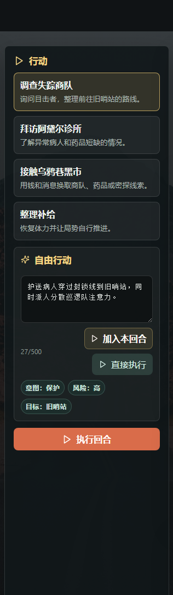

- Added tested Chinese display titles for the first-wave expansion scenario cards and campaign chapter labels. Internal scenario ids remain unchanged, while the web picker and arc panel now render titles such as `霜灯试炼`, `轨道隔离`, `盐港协定`, `雨巷异闻`, and `急诊夜班`.
- Captured a runtime screenshot showing the localized scenario picker without the previous English expansion titles:

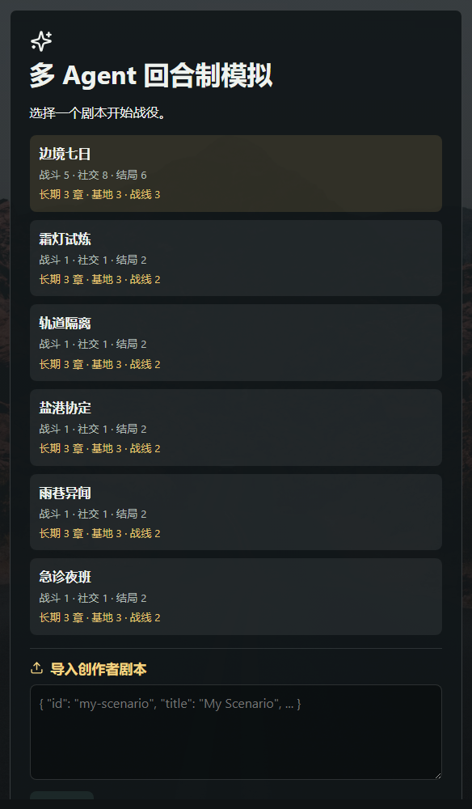

- Added a tested in-game LLM connection check. The LLM settings panel now has a Chinese `测试` button that posts the locally configured OpenAI-compatible provider settings to `POST /llm/test`, returns only non-secret status metadata, and shows a clear Chinese success/error status in the GUI.
- Localized dynamic dashboard labels used by the long-campaign GUI, including campaign action names, scenario arc summaries, inherited resources, faction resources, location ids, character ids, and Agent transparency details.
- Captured a runtime screenshot showing the LLM connection check panel and missing-key feedback without exposing any API key:

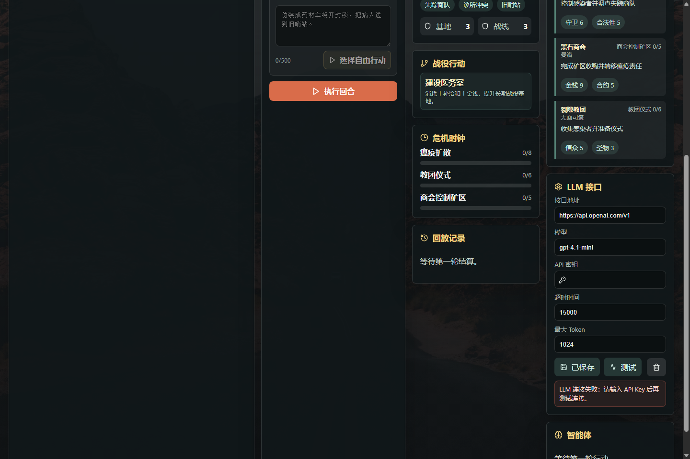

- Verification used for this slice:
  - `npm test -- apps/api/src/server.test.ts apps/web/src/api.test.ts apps/web/src/llmSettings.test.ts --reporter=dot`
  - `npm test -- packages/core/src/campaignProgression.test.ts apps/api/src/server.test.ts apps/web/src/campaignProgression.test.ts --reporter=dot`
  - `npm test -- packages/shared/src/schemas.test.ts packages/core/src/core.test.ts apps/api/src/server.test.ts apps/web/src/freeformAction.test.ts --reporter=dot`
  - `npm test -- apps/web/src/freeformAction.test.ts packages/core/src/core.test.ts apps/api/src/server.test.ts --reporter=dot`
  - `npm test -- apps/web/src/freeformAction.test.ts --reporter=dot`
  - `npm test -- apps/web/src/displayLabels.test.ts apps/web/src/scenarioSelection.test.ts apps/web/src/campaignArcStatus.test.ts --reporter=dot`
  - `npm test -- apps/web/src/playerActionDisplay.test.ts apps/web/src/chronicle.test.ts apps/web/src/displayLabels.test.ts --reporter=dot`
  - `npm test -- packages/content/src/expansionLocalization.test.ts packages/content/src/scenarioRegistry.test.ts apps/api/src/server.test.ts apps/web/src/campaignArcStatus.test.ts --reporter=dot`
  - `npm test -- packages/shared/src/creatorScenarioDraft.test.ts packages/content/src/creatorScenario.test.ts apps/web/src/scenarioImport.test.ts --reporter=dot`
  - `npm test -- packages/core/src/core.test.ts apps/api/src/server.test.ts --reporter=dot`
  - `npm test -- packages/content/src/scenarioRegistry.test.ts apps/api/src/server.test.ts --reporter=dot`
  - `npm run typecheck`
  - `npm test -- --reporter=dot`
  - `npm run build`

## 2026-06-05

- Added tested terminal-ending consequence assets for the long campaign aftermath. All 6 Border Seven Days endings now unlock a distinct `campaign.base.assets` entry and apply a referee-owned faction-front consequence instead of only recording a legacy flag.
- Extended the web long-campaign dashboard summary to show inherited campaign assets, so a completed ending becomes visible playable history on the campaign panel.
- Captured a runtime screenshot from a real `guild_case` API playthrough after `/campaigns/:id/campaign/progress` inherited `ending:guild_reform` and displayed `public_case_archive x1`:

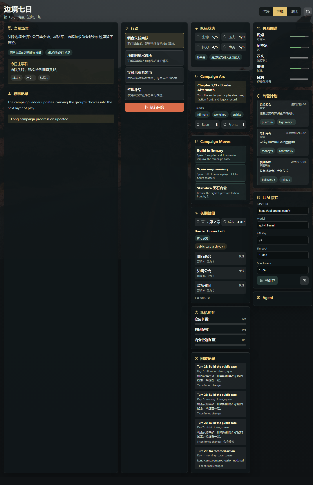

- Verification used for this slice:
  - `npm test -- packages/core/src/campaignProgression.test.ts apps/api/src/server.test.ts apps/web/src/campaignProgression.test.ts --reporter=dot`
  - `npm run typecheck`
  - `npm test -- --reporter=dot`
  - `npm run build`

## 2026-06-03

- Added a tested post-MVP continuation bridge from terminal endings into long campaign play. A day 7 night ending can now become an `ending:<id>` legacy flag, add campaign XP, record a public ending memory, and transition into the next chapter through referee-owned patches.
- Connected API campaign progression to the current scenario ending, so `/campaigns/:id/campaign/progress` can inherit the finished MVP result without the client inventing an ending id.
- Verification used for this slice:
  - `npm test -- packages/core/src/campaignProgression.test.ts apps/api/src/server.test.ts --reporter=dot`
  - `npm run typecheck`
  - `npm test -- --reporter=dot`
  - `npm run build`

- Added API-level full-campaign acceptance coverage for the Border Seven Days MVP. All 6 deterministic ending routes now run from campaign creation through repeated public `/turns/run` calls to day 7 night, while proving replay entries, turn records, snapshots, and final referee patches are persisted.
- Verification used for this slice:
  - `npm test -- apps/api/src/server.test.ts --reporter=dot`
  - `npm run typecheck`
  - `npm test -- --reporter=dot`
  - `npm run build`

- Added a tested faction-plan outcome matrix for the Border Seven Days MVP. Frontier Guild, Blackstone Consortium, and Rift Cult now each have at least one referee-owned plan result that can advance, be blocked, or redirect based on player action.
- Added missing rule branches for old outpost evidence blocking the Frontier Guild, black-market ledger exposure redirecting the consortium, and defeating Eve disrupting the cult ritual route.
- Verification used for this slice:
  - `npm test -- packages/core/src/factions.test.ts --reporter=dot`
  - `npm run typecheck`
  - `npm test -- --reporter=dot`
  - `npm run build`

- Added tested player-visible state redaction for the Border Seven Days MVP. The visibility layer now proves all 6 locations keep public information while stripping hidden info, and it also redacts character secrets, faction hidden goals, quest true backgrounds, quest hidden goals, and unrevealed hidden events.
- Verification used for this slice:
  - `npm test -- packages/core/src/visibility.test.ts --reporter=dot`
  - `npm run typecheck`
  - `npm test -- --reporter=dot`
  - `npm run build`

- Added executable scene action fixtures for the Border Seven Days MVP's 5 combat scenes and 8 social scenes.
- Added playthrough acceptance coverage proving every combat/social MVP scene can run through `runTurn`, produce legal Agent proposals, emit a referee-owned `state_patch`, and append a public result.
- Verification used for this slice:
  - `npm test -- packages/agents/src/playthrough.test.ts --reporter=dot`
  - `npm run typecheck`
  - `npm test -- --reporter=dot`
  - `npm run build`

- Added tested key-NPC proposal coverage for the Border Seven Days MVP. Representative town square, clinic, black market, old outpost, mine, and chapel routes now activate all 10 important NPCs at least once through the normal orchestrator path.
- Agent activation now filters to characters that exist in the current world, keeping first-wave expansion packages on their own scenario cast while Border Seven Days receives full NPC coverage.
- Verification used for this slice:
  - `npm test -- packages/agents/src/orchestrator.test.ts --reporter=dot`
  - `npm run typecheck`
  - `npm test -- --reporter=dot`
  - `npm run build`

- Added a tested Agent observation boundary. NPC LLM prompts now expose the actor faction's public plan context without sending faction `hiddenGoal`, location `hiddenInfo`, or character `secret` strings into the model input.
- Kept the implementation report screenshot visible while recording this backend Agent safety slice.
- Verification used for this slice:
  - `npm test -- packages/agents/src/orchestrator.test.ts --reporter=dot`

- Added a tested faction-plan dashboard panel. The web UI now summarizes each visible faction plan, leader, public clock pressure, and strongest resources so players can see faction strategy shifting after referee-owned turn results.
- Captured a runtime screenshot for the implementation report:

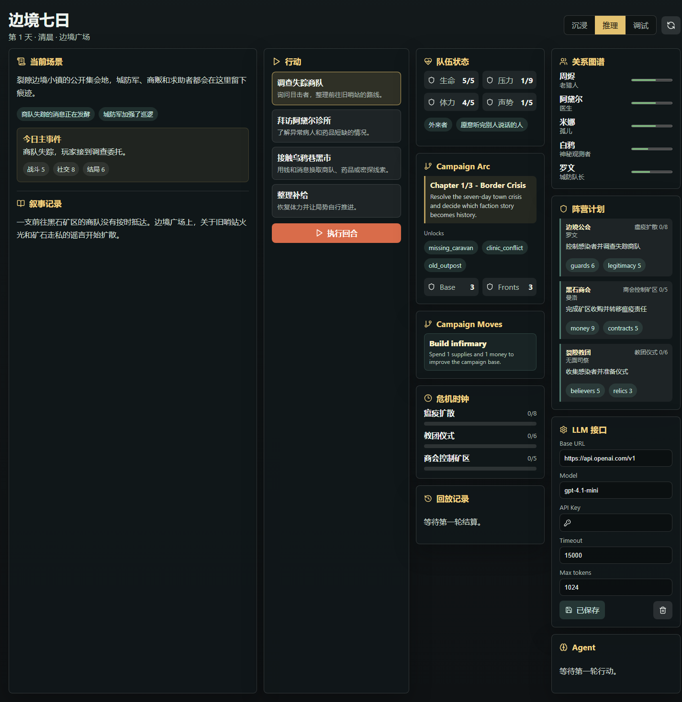

- Verification used for this slice:
  - `npm test -- apps/web/src/factionPlans.test.ts --reporter=dot`
  - `npm test -- apps/web/src/factionPlans.test.ts apps/web/src/campaignProgression.test.ts apps/web/src/api.test.ts --reporter=dot`
  - `npm run typecheck`
  - `npm test -- --reporter=dot`
  - `npm run build`

- Added API-side legality checks for long-campaign progression requests. Unknown completed quests, unavailable base facilities, unknown training skills, and unavailable faction fronts now return `invalid_campaign_progression` before any referee patch or snapshot is created.
- Verification used for this slice:
  - `npm test -- apps/api/src/server.test.ts --reporter=dot`
  - `npm run typecheck`
  - `npm test -- --reporter=dot`
  - `npm run build`

- Added tested long-campaign move choices for the web dashboard. The UI now derives base-building, training, and faction-front requests from current world state and submits them through the existing referee-owned `/campaign/progress` API.
- Verification used for this slice:
  - `npm test -- apps/web/src/campaignProgression.test.ts apps/web/src/api.test.ts --reporter=dot`
  - `npm run typecheck`
  - `npm test -- --reporter=dot`
  - `npm run build`

- Added a tested max-token budget to the shared LLM configuration contract, browser-local saved settings, API per-turn overrides, and OpenAI-compatible request payloads.
- Added an opt-in real-provider LLM smoke test that reads credentials only from environment variables.
- Documented the optional `LLM_TIMEOUT_MS` and `LLM_MAX_TOKENS` environment variables and kept real provider credentials out of committed files.
- Kept the implementation report screenshot visible while recording the LLM configuration verification gate.
- Verification used for this slice:
  - `npm test -- packages/agents/src/llm.test.ts apps/web/src/llmSettings.test.ts apps/web/src/api.test.ts apps/api/src/server.test.ts --reporter=dot`
  - `npm run test:llm:smoke`
  - `npm run typecheck`
  - `npm test -- --reporter=dot`
  - `npm run build`

## 2026-06-02

- Exposed active long campaign arc status in campaign payloads. `scenarioStatus.campaignArc` now includes the current chapter number, current chapter details, base facility hooks, and faction fronts.
- Added a tested web Campaign Arc view model and dashboard panel so players can see the current chapter focus and upcoming unlock hooks after entering a campaign.
- Updated the implementation report to keep runtime screenshots visible in the report as requested.
- Added long campaign arc metadata for Border Seven Days and all first-wave expansion packs. Built-in scenarios now declare chapter beats, base facility hooks, and faction front hooks for post-MVP expansion.
- Exposed arc summaries through the scenario catalog and web scenario picker so players can see which scenario packs have long campaign structure.
- Added the long campaign progression API slice: `/campaigns/:id/campaign/progress` now resolves chapter/base/growth/front changes through the rules engine, stores the resulting snapshot, and records replayable referee patches.
- Added the web long campaign summary panel for chapter, campaign XP, base facilities, faction front pressure, and replay visibility.
- Captured a runtime screenshot for the implementation report:

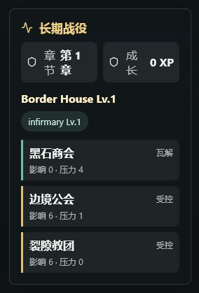

- Added runtime creator scenario management: import, export, protected deletion, browser-local restore, and API-side persistence for creator definitions.
- Added server-side Agent transparency redaction: immersive hides proposals, inference exposes only public reasoning, and debug exposes hidden summaries, hidden reasons, and hidden patch entries.
- Connected web state polling and SSE replay requests to the selected transparency mode, and added a tested Agent transparency view model for the panel.
- Verification used for the latest slice:
  - `npm test -- apps/api/src/server.test.ts apps/web/src/campaignArcStatus.test.ts --reporter=dot`
  - `npm run typecheck`
  - `npm test -- --reporter=dot`
  - `npm run build`

## 2026-06-02 - Scenario long campaign arcs

- Added a `campaignArc` contract to built-in scenario packages with chapter beats, base facilities, and faction fronts.
- Added arc metadata for `border-seven-days`, `frost-lantern-trial`, `orbital-quarantine`, `salt-harbor-accord`, `rain-alley-haunting`, and `emergency-ward-night`.
- Exposed compact arc summaries in the API scenario catalog and web scenario selection model.
- Verification used: `npm test -- packages/content/src/scenarioRegistry.test.ts apps/api/src/server.test.ts apps/web/src/scenarioSelection.test.ts --reporter=dot`.

## Publishing Discipline

- Keep docs in the same change set as meaningful gameplay, API, Agent, persistence, or UX changes.
- Push verified slices to GitHub promptly after the gate passes.
- Prefer draft pull requests for ongoing work so the branch can keep moving while review remains explicit.

## 2026-06-02 - Failure recovery branches

- Added tested recovery branch actions for the plague, mine takeover, and cult ritual clocks when they approach collapse before the seventh-night ending check.
- Added referee-level recovery consequences for `recovery:plague`, `recovery:mine`, and `recovery:cult` leverage tokens. Successful recovery lowers the matching crisis clock and records a public recovery event; failed recovery increases pressure and keeps the campaign moving.
- Verification used: `npm test -- packages/content/src/borderSevenDays.test.ts --reporter=dot` and `npm test -- packages/core/src/core.test.ts --reporter=dot`.

## 2026-06-02 - First-wave expansion packs

- Added tested seed packages for the first expansion wave after the Border Seven Days MVP: science fiction (`Orbital Quarantine`), historical (`Salt Harbor Accord`), urban supernatural (`Rain Alley Haunting`), and realistic profession (`Emergency Ward Night`). The existing cultivation package remains `Frost Lantern Trial`.
- Each expansion package uses the shared `ScenarioPackage` registry contract, creates a `WorldStateSchema`-valid world, exposes playable actions, and evaluates deterministic success/failure endings.
- Verification used: `npm test -- packages/content/src/scenarioRegistry.test.ts --reporter=dot`.

## 2026-06-02 - Expansion playthroughs

- Added deterministic three-day playthrough coverage for all first-wave expansion packages through the shared Agent orchestration and referee pipeline.
- Added generic scenario clock consequences keyed by `scenario:*`, `clock:*`, and `pressureClock:*` leverage tokens. Successful expansion turns advance scenario stability clocks and player momentum; failures advance the pressure line without creating a hard game over.
- Made Border Seven Days-specific referee side effects conditional on the target relationship, location, or clock existing so the same rules engine can safely adjudicate other scenario worlds.
- Verification used: `npm test -- packages/agents/src/playthrough.test.ts --reporter=dot`.

## 2026-06-02 - Expansion pressure playthroughs

- Added deterministic pressure-route coverage for all first-wave expansion packages, proving cultivation, science fiction, historical, urban supernatural, and realistic profession packs can reach their failure/pressure endings.
- Pressure routes now replay from emitted `state_patch` records to the same endings as the original run.
- Referee checks now separate system leverage tokens (`scenario:*`, `clock:*`, `pressureClock:*`, `route:*`, `step:*`) from player-facing mechanical leverage so hidden routing markers cannot inflate dice results.
- Verification used: `npm test -- packages/agents/src/playthrough.test.ts --reporter=dot`.

## 2026-06-02 - Long campaign foundation

- Added optional `campaign` state for post-MVP expansion without breaking existing Border Seven Days and first-wave expansion worlds.
- Added referee-owned long campaign progression patches for chapter transitions, base facility upgrades, character skill growth, and faction-war front status changes.
- State patches can initialize the optional `campaign` root while still rejecting unknown nested fields elsewhere.
- Verification used: `npm test -- packages/core/src/campaignProgression.test.ts --reporter=dot`.

## 2026-06-02 - Long campaign API and dashboard

- Exposed tested long campaign progression through `POST /campaigns/:id/campaign/progress`.
- Added in-memory and Prisma store support for synthetic progression turns so state snapshots, replay records, public chronicle, hidden logs, and compressed memories remain complete.
- Added a tested web view model and dashboard module for long campaign chapter, XP, base facilities, and faction fronts.
- Verification used: `npm test -- apps/api/src/server.test.ts apps/web/src/api.test.ts apps/web/src/campaignProgression.test.ts --reporter=dot`, `npm run typecheck`, `npm test -- --reporter=dot`, and `npm run build`.
