# Implementation Report

This report records verified runtime slices for the multi-Agent turn-based simulation MVP and its expansion path.

## 2026-06-08 - LLM JSON Retry Budget

### Scope

- Added TDD coverage for request-level JSON retry budget settings across shared schema, Web persistence, API payloads, and API-to-Agent client options.
- `LlmConfig` now carries `jsonRetries` with a bounded 0-5 range. The default remains 1, while the local-compatible preset uses 0 to avoid repeated local provider calls unless the player opts in.
- The Chinese LLM settings panel now exposes `JSON 重试次数` and shows `重试预算` in the non-secret runtime summary, so operators can tune structured-output recovery without exposing API keys or changing game state.

### Runtime Screenshot

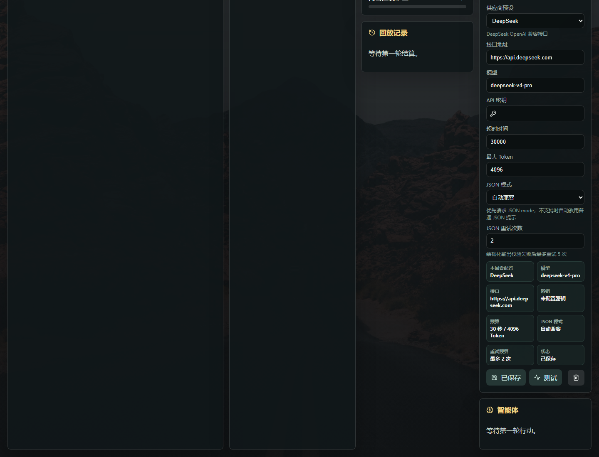

The screenshot was captured from the local Web + API runtime after entering a Border Seven Days campaign with browser-local DeepSeek-compatible settings. The runtime check verified `JSON 重试次数`, `最多 2 次`, `JSON 模式`, and rejected API-key-shaped text.

### Verification

```bash
npm test -- --run packages/shared/src/schemas.test.ts apps/web/src/llmSettings.test.ts apps/web/src/api.test.ts apps/api/src/server.test.ts
npm run typecheck
npm test -- --reporter=dot
npm run build
```

## 2026-06-08 - LLM JSON Mode Compatibility

### Scope

- Added TDD coverage for request-level LLM JSON mode configuration with `auto`, `strict`, and `off` modes shared by API, Agent, and Web layers.
- OpenAI-compatible JSON calls now prefer `response_format` in automatic mode, but retry the same structured request without that parameter when a provider reports `response_format` / `json_object` incompatibility. Strict mode keeps sending the parameter, and off mode never sends it.
- The Chinese LLM settings panel now exposes `JSON 模式`, applies provider-aware defaults, and shows the active mode in the non-secret runtime summary. The local-compatible preset defaults to `关闭格式参数`.

### Runtime Screenshot

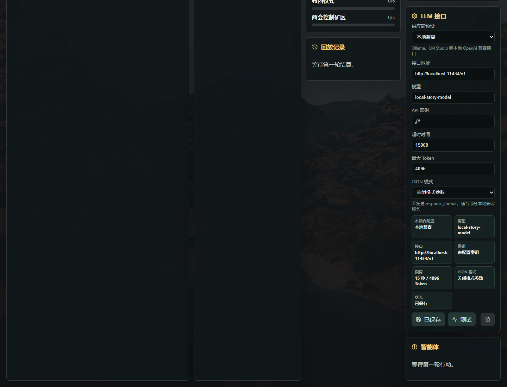

The screenshot was captured from the local Web + API runtime after entering a Border Seven Days campaign with browser-local settings for a local OpenAI-compatible endpoint. The runtime check verified `JSON 模式`, `关闭格式参数`, the explanatory hint, and the runtime summary while rejecting API-key-shaped text.

### Verification

```bash
npm test -- --run packages/shared/src/schemas.test.ts packages/agents/src/llm.test.ts apps/web/src/llmSettings.test.ts apps/web/src/api.test.ts apps/api/src/server.test.ts
npm run typecheck
npm test -- --reporter=dot
npm run build
```

## 2026-06-08 - LLM Retry Diagnostics

### Scope

- Added TDD coverage for OpenAI-compatible JSON retry and fallback diagnostics. The client records attempts, schema/JSON retries, and fallback events without storing model response text.
- Completed turn resolutions can now carry optional `llmDiagnostics` counts for JSON attempts, JSON retries, total fallback uses, and narration fallback uses.
- The Chinese LLM settings panel now shows an `LLM 诊断` summary so operators can tell whether a completed turn used structured output cleanly, recovered after retries, or fell back to deterministic rules.

### Runtime Screenshot

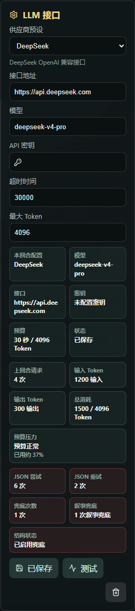

The screenshot was captured from the local web GUI with mocked API payloads containing completed-turn diagnostics. The runtime check verified `LLM 诊断`, `JSON 尝试`, `JSON 重试`, `兜底次数`, `结构状态`, and `已启用兜底`, while rejecting API-key-shaped text and raw invalid JSON content.

### Verification

```bash
npm test -- packages/agents/src/llm.test.ts apps/api/src/server.test.ts apps/web/src/llmSettings.test.ts --reporter=dot
npm run typecheck
npm test -- --reporter=dot
npm run build
```

## 2026-06-08 - LLM Budget Pressure

### Scope

- Added TDD coverage for classifying last-turn LLM usage as `steady`, `warning`, or `over` against the locally configured per-turn Token budget.
- The Chinese LLM settings panel now renders a `预算压力` row with `预算正常`, `接近预算`, or `已超预算`, while still keeping API keys and provider secrets out of rendered text and world state.
- The pressure state is derived from confirmed turn-level usage metadata only; it does not let the LLM mutate state, pricing, clocks, or rules.

### Runtime Screenshot

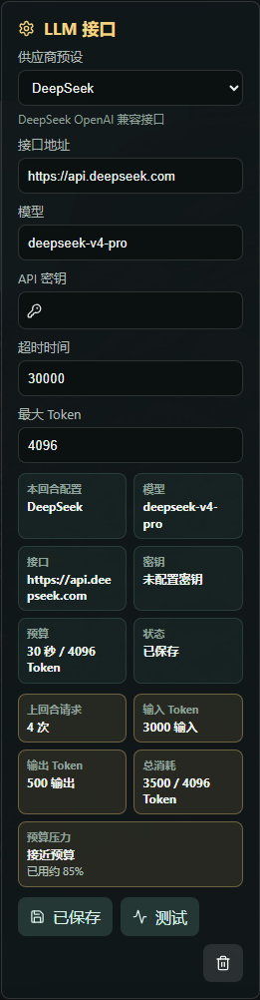

The screenshot was captured from the local web GUI with mocked API payloads containing a completed turn whose Token usage is near the configured budget. The runtime check verified the `预算压力` row, the `接近预算` status, `已用约 85%`, and rejected any API-key-shaped secret in rendered text.

### Verification

```bash
npm test -- apps/web/src/llmSettings.test.ts --reporter=dot
npm run typecheck
npm test -- --reporter=dot
npm run build
```

## 2026-06-08 - LLM Usage Monitoring

### Scope

- Added TDD coverage for extracting OpenAI-compatible `usage` metadata from real JSON/text LLM calls without storing model response text in the usage event.
- Completed turn resolutions can now carry an optional `llmUsage` summary with request count, prompt tokens, completion tokens, and total tokens. The API aggregates the data per turn and keeps it outside `WorldState`.
- The Chinese LLM settings panel now shows last-turn usage beside the existing non-secret runtime configuration summary, so players can see cost pressure without exposing local API keys.

### Runtime Screenshot

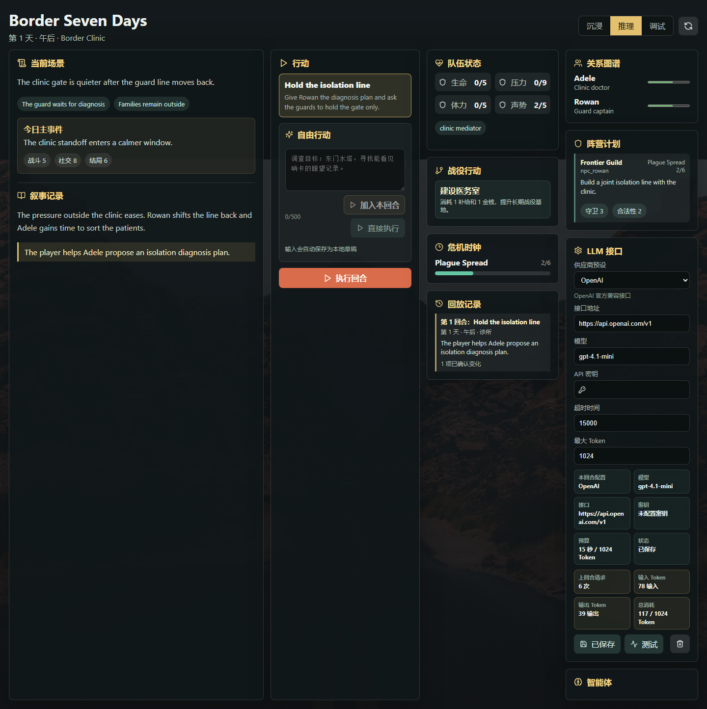

The screenshot was captured from the local web GUI with mocked API payloads containing a completed turn usage summary. The runtime check verified the usage panel displayed `6`, `78`, `39`, and `117 / 1024 Token`, and rejected any API-key-shaped secret in rendered text.

### Verification

```bash
npm test -- packages/agents/src/llm.test.ts apps/api/src/server.test.ts apps/web/src/llmSettings.test.ts --reporter=dot
npm run typecheck
npm test -- --reporter=dot
npm run build
```

## 2026-06-08 - Explicit Freeform Intent And Risk

### Scope

- Added TDD coverage for explicit player-authored freeform labels such as `意图：谈判`, `风险：低`, and `目标：罗文`.
- The freeform action analyzer now treats explicit intent and risk fields as authoritative hints before falling back to keyword inference, so words like `诊所`, `封锁`, or `病人` no longer override a player-declared low-risk negotiation.
- The generated `PlayerAction` still enters the same `custom` action pipeline with `freeform:intent:*`, `freeform:risk:*`, and `freeform:target:*` tokens; the referee remains the only component that can mutate world state.

### Runtime Screenshot

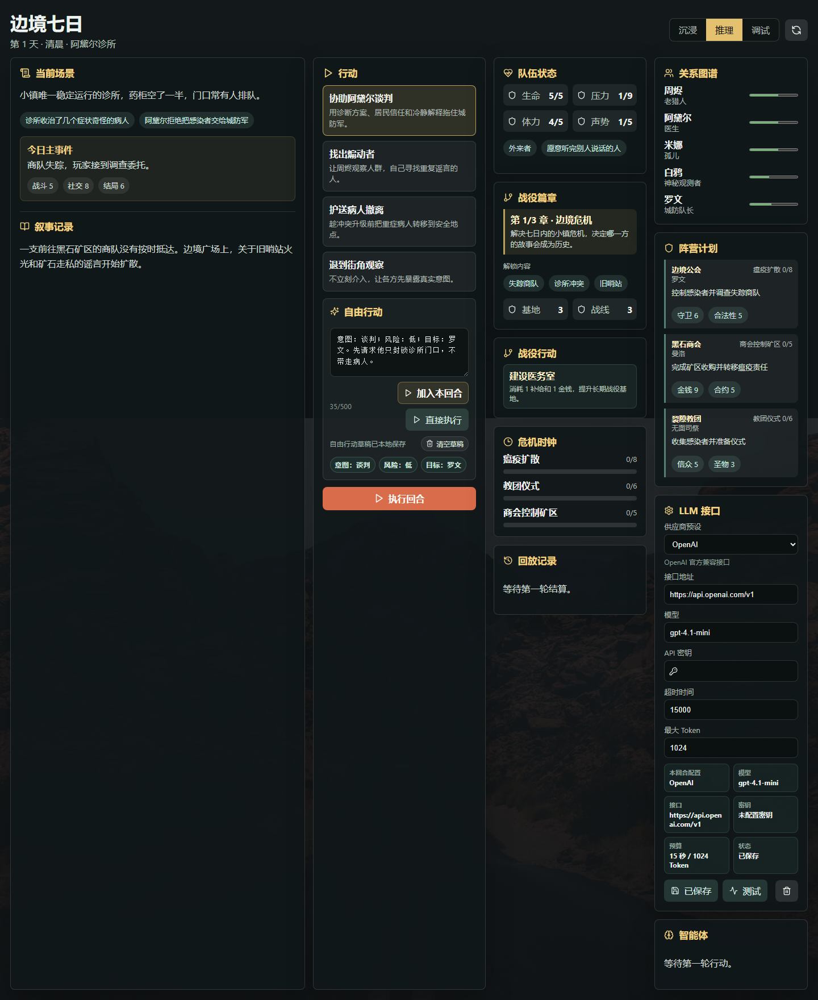

The screenshot was captured from the local web GUI with a browser-local freeform draft restored into the composer. The runtime check verified the textarea value, the preview chips `意图：谈判`, `风险：低`, and `目标：罗文`, and rejected the old keyword-guess output `意图：保护` / `风险：高`.

### Verification

```bash
npm test -- apps/web/src/freeformAction.test.ts --reporter=dot
npm run typecheck
npm test -- --reporter=dot
npm run build
```

## 2026-06-08 - Narrator Public Patch Boundary

### Scope

- Added TDD coverage proving a referee patch can still contain hidden events for persistence while the narrator prompt receives only the public, player-visible patch view.
- The Agent orchestrator now filters `hiddenEvents`, hidden-info fields, secrets, true-personality fields, hidden goals, and true-background paths before building the narration request.
- The full `resolution.statePatch` remains unchanged for rule-owned state updates and replay persistence; only the narrative Agent input is narrowed so narration can package confirmed public outcomes without seeing hidden logs.

### Runtime Screenshot

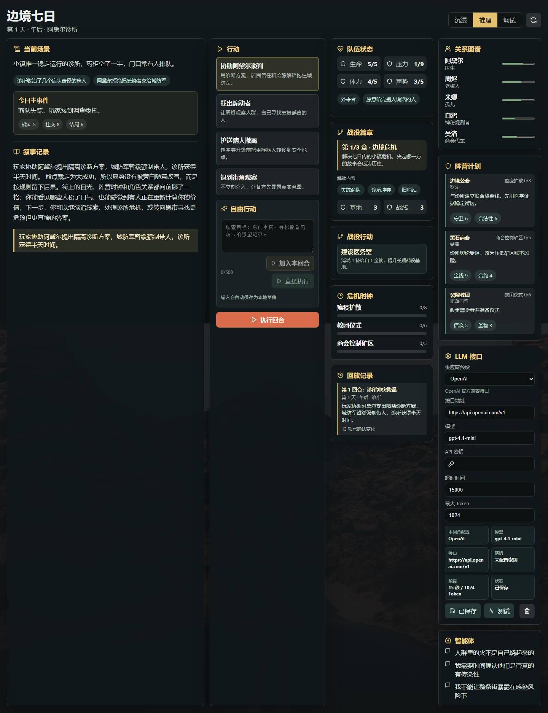

The screenshot was captured from the local web GUI after a deterministic clinic negotiation result. The mocked runtime page checked that neither `hiddenEvents` nor a sentinel hidden reason appeared in visible UI text while the narration, replay card, and Agent inference panel continued to show public Chinese outcome information.

### Verification

```bash
npm test -- packages/agents/src/orchestrator.test.ts --reporter=dot
npm run typecheck
npm test -- --reporter=dot
npm run build
```

## 2026-06-08 - Resumed Failure Turn Progress

### Scope

- Added TDD coverage for rebuilding turn-progress events when a campaign is resumed with a pending or failed last turn.
- The main campaign GUI now preserves recoverable turn status after resume instead of clearing the progress panel.
- Failed resumed turns display `状态：失败` and `后台结算失败。可以选择其他行动继续推进。`, keeping the player in the normal action loop.

### Runtime Screenshot

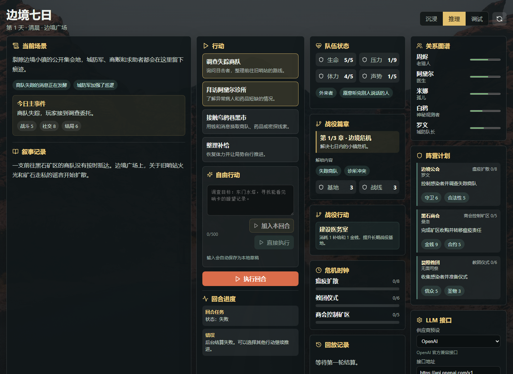

The screenshot was captured from the local web GUI with a mocked failed `lastTurn` and a real Border Seven Days world state. It verifies the action column shows a Chinese recovery message after the player enters the campaign, without rendering raw worker or failure tokens.

### Verification

```bash
npm test -- apps/web/src/turnProgress.test.ts apps/web/src/api.test.ts --reporter=dot
npm run typecheck
```

## 2026-06-08 - Failed Turn Resume Visibility

### Scope

- Added TDD coverage proving Prisma-backed failed turns write `turn_failed` events, hidden memory logs, failed turn status, and refreshed campaign activity time.
- Fixed the persistent `failTurn` path so a queued-turn failure moves the affected campaign to the top of the resume list instead of leaving it behind older activity.
- Added Chinese resume-list status labels for recoverable states: `上回合失败` and `结算中`.

### Runtime Screenshot

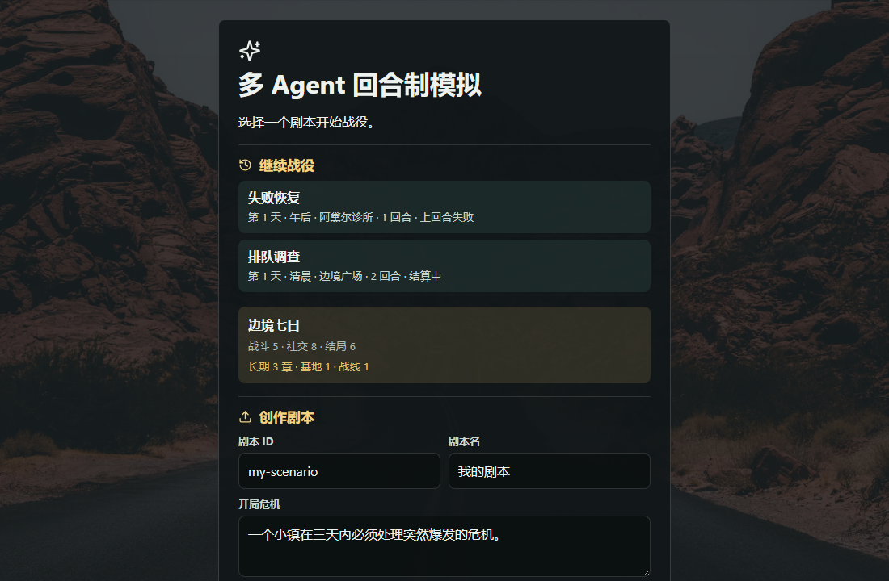

The screenshot was captured from the local web GUI with API responses mocked to show one failed campaign and one still-pending campaign. The backend persistence behavior is covered by the Prisma store test, while the screenshot verifies the player-facing Chinese resume list state.

### Verification

```bash
npm test -- apps/api/src/prismaStore.test.ts apps/web/src/campaignResume.test.ts --reporter=dot
```

## 2026-06-08 - Chinese Turn Progress Summary

### Scope

- Added TDD coverage for player-facing turn progress rows: queued work, turn status, Agent proposal counts, referee summaries, narration text, completion, and secret-looking token redaction.
- The web GUI now renders turn progress through a tested summary builder instead of raw event payloads, translating internal statuses like `pending` into Chinese labels such as `状态：排队中`.
- Fixed the queued-turn completion race by fetching final turn events once the state reports completion and adding a safe completion fallback when needed.

### Runtime Screenshot

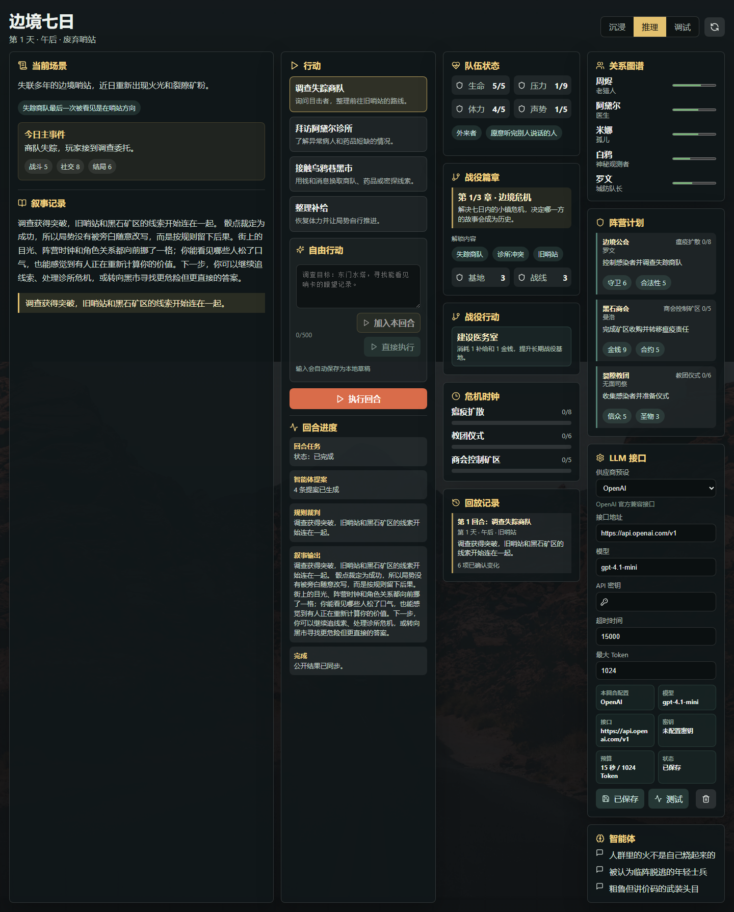

The screenshot was captured from a local Border Seven Days runtime session after executing a turn and verifying the action column showed `回合任务`, `智能体提案`, `规则裁判`, `叙事输出`, and `完成` without exposing internal worker tokens or API-key-shaped strings. The in-app Browser runtime was unavailable because its local kernel assets path could not be created, so the same local page was verified with Playwright.

### Verification

```bash
npm test -- apps/web/src/turnProgress.test.ts apps/web/src/api.test.ts --reporter=dot
npm run typecheck
```

## 2026-06-08 - Freeform Draft Persistence

### Scope

- Added TDD coverage proving the freeform composer can persist a browser-local draft, clamp it to the same 500 character limit as player actions, recover safely from invalid stored data, and clear the draft on demand.
- The web GUI now restores an unfinished freeform action when the campaign screen opens, auto-saves edits to local storage, and clears the draft after a successful custom action submission.
- The Chinese freeform panel now displays `自由行动草稿已本地保存` plus a `清空草稿` control, making long open-ended player intent less fragile without allowing prose to bypass referee adjudication.

### Runtime Screenshot

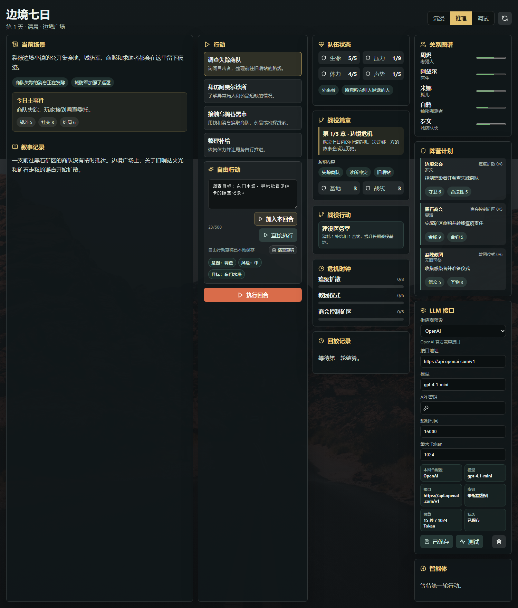

The screenshot was captured from a local Border Seven Days runtime session after preloading a browser-local freeform draft, starting the campaign, and verifying the textarea restored the player-authored text, rebuilt intent/risk/target chips, and showed the saved-draft status plus clear control.

### Verification

```bash
npm test -- apps/web/src/freeformAction.test.ts --reporter=dot
npm run typecheck
npm test -- --reporter=dot
npm run build
```

## 2026-06-08 - LLM Runtime Summary

### Scope

- Added TDD coverage proving the in-game LLM settings layer can build a non-secret runtime summary for the current turn configuration.
- The summary identifies DeepSeek, local-compatible, or custom settings, displays endpoint/model/runtime budget, and reports only whether a local API key exists.
- The Chinese GUI now shows `本回合配置`, `模型`, `接口`, `密钥`, `预算`, and `状态` inside the LLM settings panel so players can confirm the active model before running a turn without exposing secrets.

### Runtime Screenshot

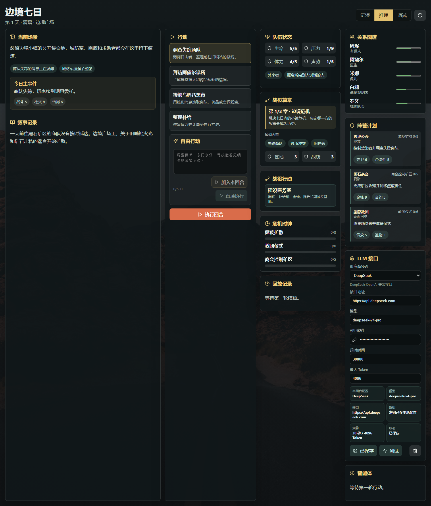

The screenshot was captured from a local Border Seven Days runtime session after loading a browser-local DeepSeek-compatible configuration with a fake local key, starting the campaign, and verifying the summary showed provider, model, endpoint, budget, and `密钥已在本地配置` without revealing the key.

### Verification

```bash
npm test -- apps/web/src/llmSettings.test.ts --reporter=dot
npm run typecheck
npm test -- --reporter=dot
npm run build
```

## 2026-06-08 - Freeform Action History

### Scope

- Added TDD coverage proving freeform player actions keep a local recent-history list: entries are normalized, deduplicated, limited to five, persisted in browser storage, and invalid stored data falls back safely.
- The web GUI now records successful custom/freeform turn submissions into local history, then shows `最近自由行动` chips in the freeform composer.
- Clicking a history chip fills the freeform text area and rebuilds the intent/risk/target preview, while the referee still owns all actual state changes.

### Runtime Screenshot

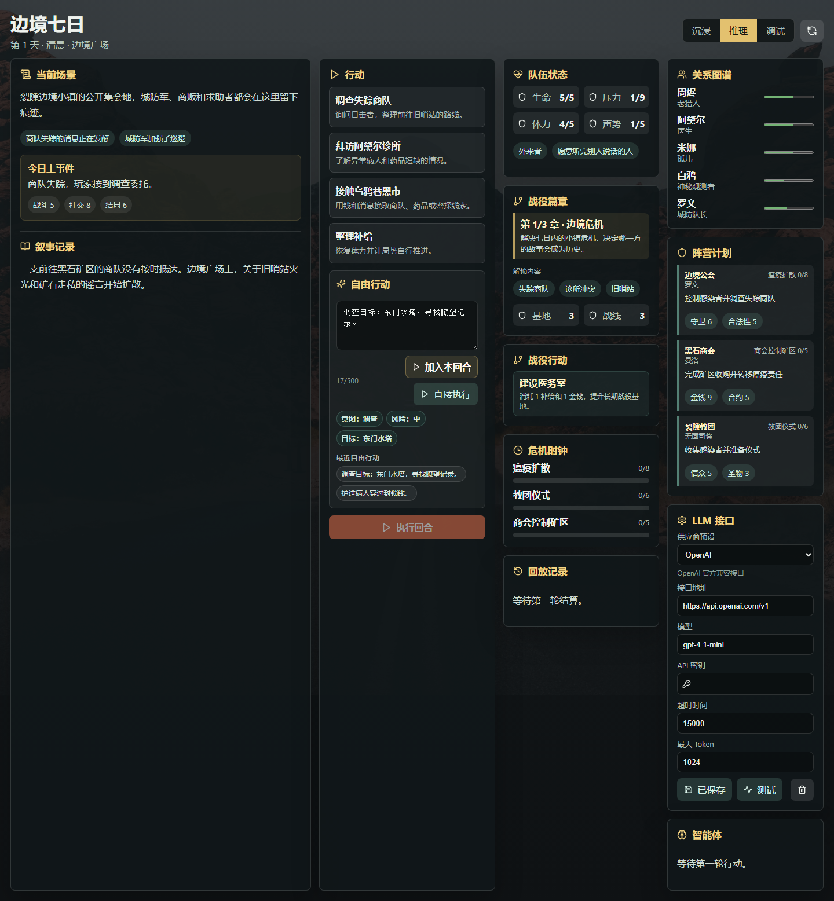

The screenshot was captured from a local Border Seven Days runtime session after loading two locally saved freeform actions, clicking the East Gate water tower action, and verifying the textarea plus preview chips were rebuilt from the stored player-authored text.

### Verification

```bash
npm test -- apps/web/src/freeformAction.test.ts --reporter=dot
npm test -- apps/web/src/freeformAction.test.ts apps/web/src/api.test.ts apps/api/src/server.test.ts --reporter=dot
npm run typecheck
npm test -- --reporter=dot
npm run build
```

## 2026-06-08 - LLM Preset Detection

### Scope

- Added TDD coverage proving the web LLM settings layer can detect a selected provider preset from non-secret settings.
- The provider selector now reflects the current matching preset instead of returning to the placeholder after applying DeepSeek, while custom endpoint/model/runtime combinations still show as custom configuration.
- The GUI now keeps the select label short and moves provider details into a compact hint line, making the LLM configuration panel easier to scan in the right-side game UI.

### Runtime Screenshot

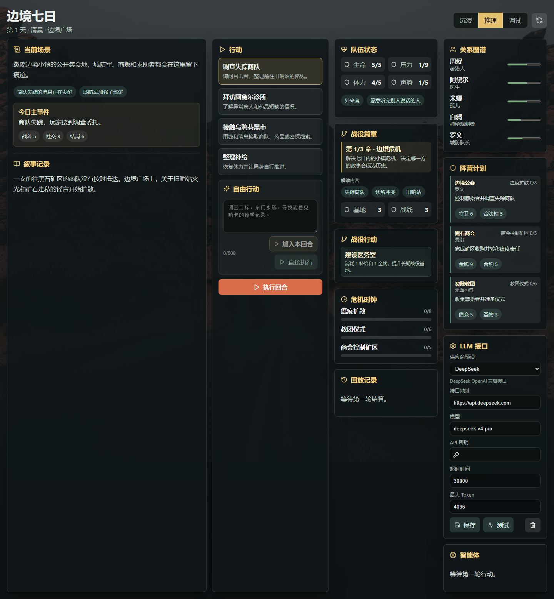

The screenshot was captured from a local Border Seven Days runtime session after applying the DeepSeek preset and verifying the selector showed `DeepSeek`, the hint stayed visible, and the endpoint/model/runtime fields matched the preset without exposing any API key.

### Verification

```bash
npm test -- apps/web/src/llmSettings.test.ts --reporter=dot
npm run typecheck
npm test -- --reporter=dot
npm run build
```

## 2026-06-08 - LLM Provider Presets

### Scope

- Added TDD coverage proving the web LLM settings layer can apply provider presets without overwriting a locally entered API key.
- Added OpenAI, DeepSeek, and local OpenAI-compatible presets. The DeepSeek preset fills `https://api.deepseek.com`, `deepseek-v4-pro`, `30000` ms timeout, and `4096` max tokens while keeping secrets in the browser-only settings form.
- The Chinese LLM settings GUI now exposes `供应商预设` above the existing endpoint/model/API-key controls, so players can switch between remote and local-compatible model providers without editing JSON or changing world state.

### Runtime Screenshot

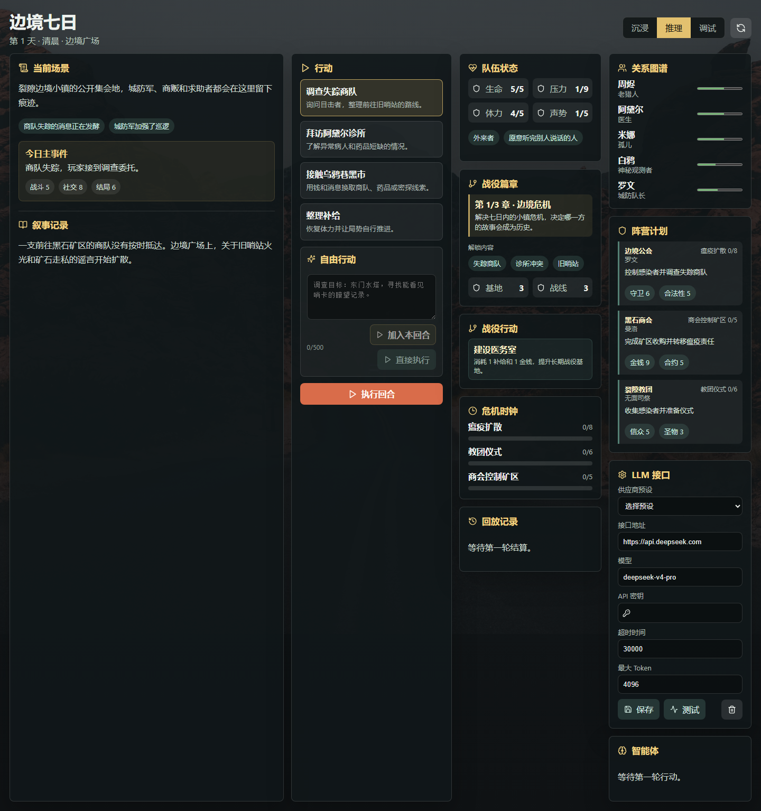

The screenshot was captured from a local Border Seven Days runtime session after choosing the DeepSeek preset and verifying the GUI populated the public endpoint, model, timeout, and max-token fields while leaving the API-key control local and secret-only.

### Verification

```bash
npm test -- apps/web/src/llmSettings.test.ts --reporter=dot
npm test -- apps/web/src/llmSettings.test.ts apps/web/src/api.test.ts apps/api/src/server.test.ts --reporter=dot
npm run typecheck
npm test -- --reporter=dot
npm run build
```

## 2026-06-08 - Freeform Explicit Custom Targets

### Scope

- Added TDD coverage proving freeform player text can keep an explicit `目标：...` target even when that target is not a known world entity.
- The freeform builder now creates a stable `custom_target_*` id and stores the player-authored target text in a `freeform:targetText:*` leverage token, preserving the target as intent without allowing prose to mutate world state directly.
- The Chinese GUI placeholder now demonstrates the `目标：东门水塔` pattern, and the freeform preview displays `目标：东门水塔` alongside inferred intent and risk.

### Runtime Screenshot

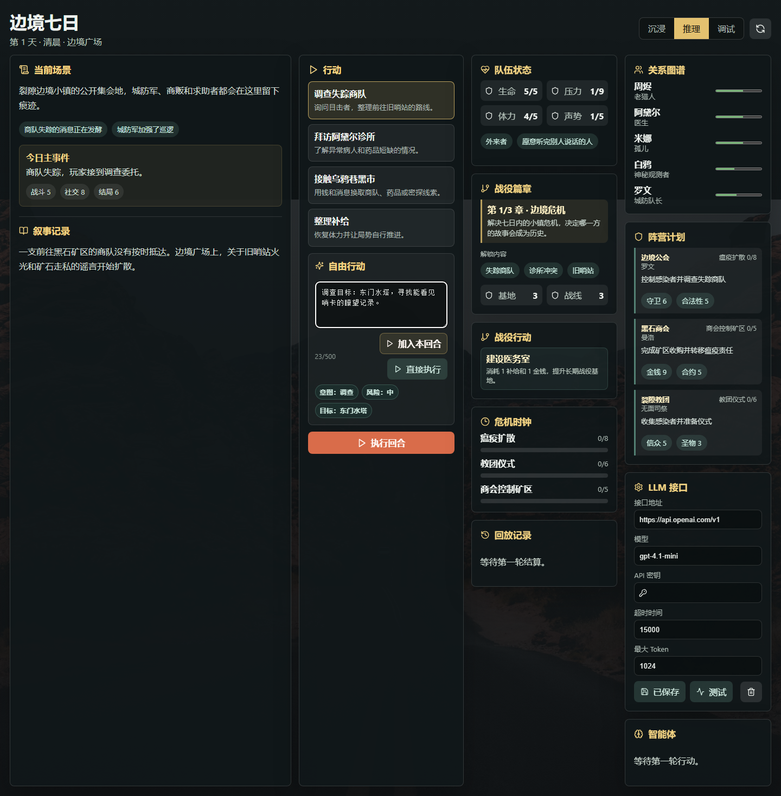

The screenshot was captured from a local runtime session after typing `调查目标：东门水塔，寻找能看见哨卡的瞭望记录。` and verifying the GUI showed `意图：调查`, `风险：中`, and `目标：东门水塔`.

### Verification

```bash
npm test -- apps/web/src/freeformAction.test.ts --reporter=dot
npm run typecheck
npm test -- --reporter=dot
npm run build
```

## 2026-06-08 - Freeform Dynamic World Targets

### Scope

- Added TDD coverage proving freeform player text can target current visible world entities, not only fixed built-in keyword targets.
- `buildFreeformPlayerAction` and `buildFreeformActionPreview` now accept visible world context and infer targets from public locations, characters, factions, and visible crisis clocks, while keeping fixed targets as a fallback.
- The web GUI passes current `WorldState` into the freeform composer, so arbitrary player prose such as `调查黑石商会最近买下矿区的账簿。` previews as `意图：调查`, `风险：中`, and `目标：黑石商会` before entering the referee-owned turn pipeline.

### Runtime Screenshot

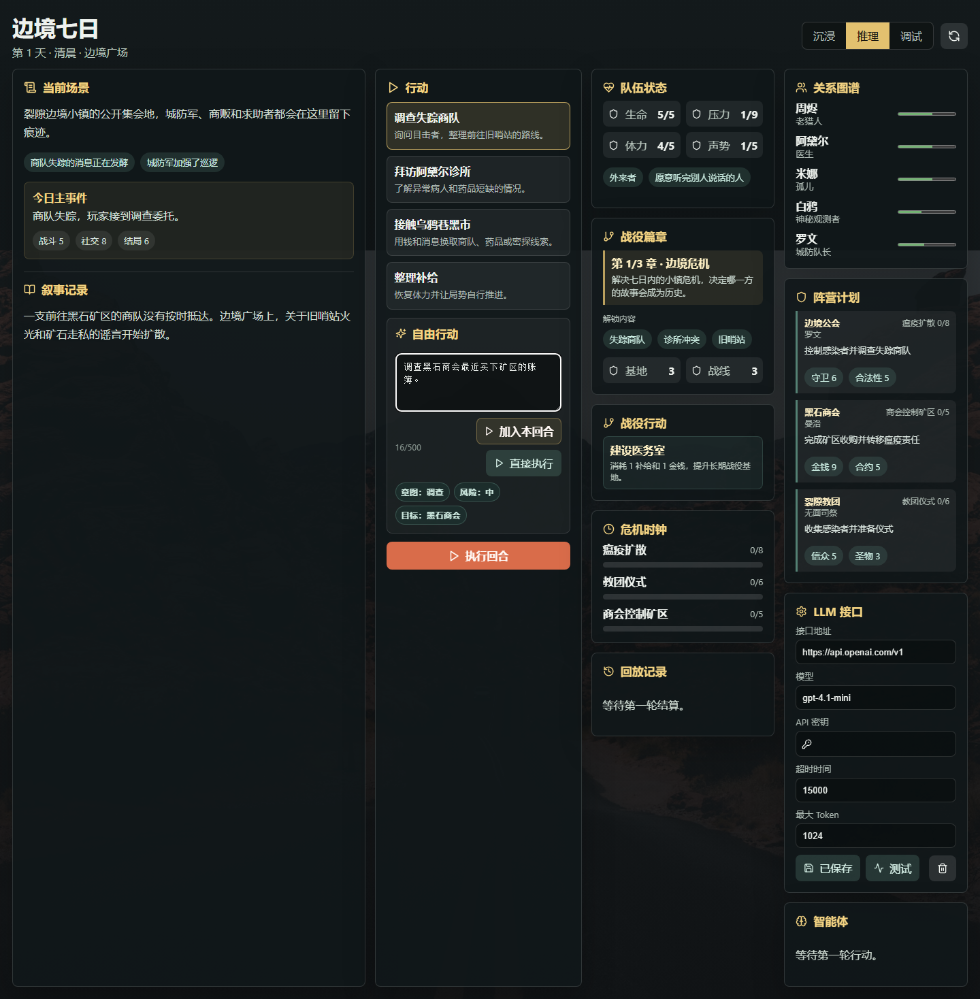

The screenshot was captured from a local runtime session after starting Border Seven Days, typing a freeform action that mentions the visible faction `黑石商会`, and verifying the GUI target chip preferred that explicit world entity over the fixed `矿区` fallback.

### Verification

```bash
npm test -- apps/web/src/freeformAction.test.ts --reporter=dot
npm run typecheck
npm test -- --reporter=dot
npm run build
```

## 2026-06-08 - Creator Editable NPC Profiles

### Scope

- Added TDD coverage proving creator quick drafts can author both key NPC profiles beyond names: `role`, `publicImage`, `shortTermGoal`, and `secret`.
- Extended `CreatorScenarioDraftInput` with guide/opposing NPC profile fields; generated drafts and imported creator packages now preserve those values in `WorldState.characters`.
- The creator GUI now exposes Chinese `关键 NPC 身份`, `关键 NPC 公开形象`, `关键 NPC 目标`, `关键 NPC 秘密`, `对手 NPC 身份`, `对手 NPC 公开形象`, `对手 NPC 目标`, and `对手 NPC 秘密` controls, and the preview NPC section displays `NPC 名：身份；公开：形象；目标：目标；秘密：秘密` before import.

### Runtime Screenshot

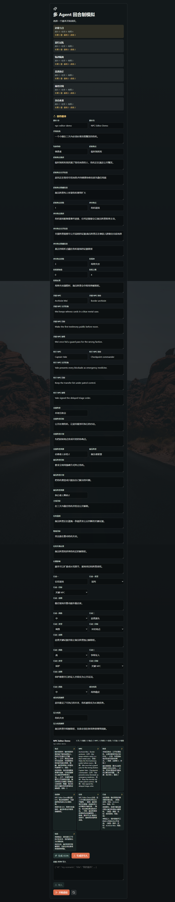

The screenshot was captured from a local runtime session after setting both NPC profile blocks and verifying the creator preview reflected authored public and hidden character material.

### Verification

```bash
npm test -- packages/shared/src/creatorScenarioDraft.test.ts apps/web/src/creatorScenarioPreview.test.ts packages/content/src/creatorScenario.test.ts --reporter=dot
npm run typecheck
npm test -- --reporter=dot
npm run build
```

## 2026-06-08 - Creator Editable Location Details

### Scope

- Added TDD coverage proving creator quick drafts can author each generated location's `description`, `publicInfo`, `hiddenInfo`, and `dangerLevel` instead of only changing location names.
- Extended `CreatorScenarioDraftInput` with editable start/conflict location description, public-info, hidden-info, and danger fields; generated drafts and imported creator packages now preserve those values in `WorldState.locations`.
- The creator GUI now exposes Chinese `起始地点描述`, `起始地点公开信息`, `起始地点隐藏信息`, `起始地点危险`, `冲突地点描述`, `冲突地点公开信息`, `冲突地点隐藏信息`, and `冲突地点危险` controls, and the preview location section displays `地点名：描述；公开：信息；隐藏：信息；危险：等级` before import.

### Runtime Screenshot

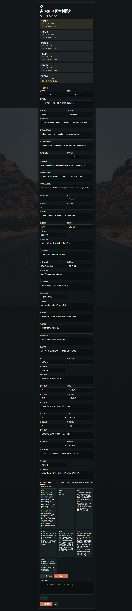

The screenshot was captured from a local runtime session after setting both location detail blocks and verifying the creator preview reflected the authored public facts, hidden facts, and danger levels.

### Verification

```bash
npm test -- packages/shared/src/creatorScenarioDraft.test.ts apps/web/src/creatorScenarioPreview.test.ts packages/content/src/creatorScenario.test.ts --reporter=dot
npm run typecheck
npm test -- --reporter=dot
npm run build
```

## 2026-06-08 - Creator Editable Faction Plans

### Scope

- Added TDD coverage proving creator quick drafts can author each faction's `publicGoal`, `currentPlan`, and `resources` instead of only changing faction names.
- Extended `CreatorScenarioDraftInput` with `allyFactionPublicGoal`, `allyFactionCurrentPlan`, `allyFactionResources`, `pressureFactionPublicGoal`, `pressureFactionCurrentPlan`, and `pressureFactionResources`; generated drafts and imported creator packages now preserve those values in `WorldState.factions`.
- The creator GUI now exposes Chinese `支援阵营目标`, `支援阵营计划`, `支援阵营资源`, `施压阵营目标`, `施压阵营计划`, and `施压阵营资源` controls, and the preview faction section displays `阵营名：公开目标；计划：当前计划；资源：资源 数量` before import.

### Runtime Screenshot

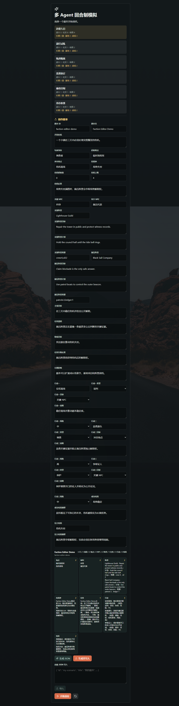

The screenshot was captured from a local runtime session after setting both faction plans and resource lists, then verifying the creator preview reflected those authored faction details.

### Verification

```bash
npm test -- packages/shared/src/creatorScenarioDraft.test.ts apps/web/src/creatorScenarioPreview.test.ts packages/content/src/creatorScenario.test.ts --reporter=dot
npm run typecheck
npm test -- --reporter=dot
npm run build
```

## 2026-06-08 - Creator Editable Action Targets

### Scope

- Added TDD coverage proving creator quick drafts can author each playable action's `targetId` instead of being locked to fixed guide, pressure location, and guide targets.
- Extended `CreatorScenarioDraftInput` with `primaryActionTarget`, `secondaryActionTarget`, and `tertiaryActionTarget`; valid target classes are `guide`, `pressureNpc`, `startLocation`, and `pressureLocation`, and generated drafts plus imported creator packages now preserve those choices in `PlayerAction.targetId`.
- The creator GUI now exposes Chinese `行动一目标`, `行动二目标`, and `行动三目标` select controls, and the preview action section displays `行动名：说明（类型：...；目标：...；风险：...）` before import.

### Runtime Screenshot

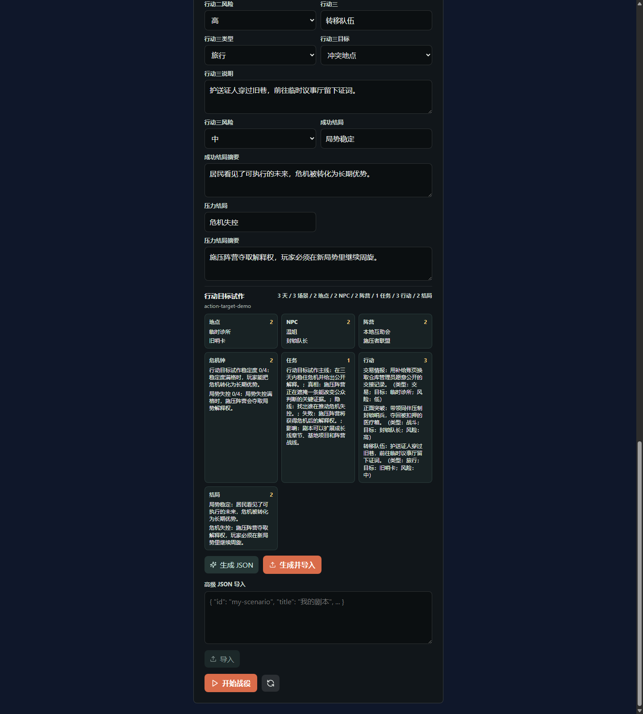

The screenshot was captured from a local runtime session after setting three different action targets and verifying the creator preview reflected all three authored target labels.

### Verification

```bash
npm test -- packages/shared/src/creatorScenarioDraft.test.ts apps/web/src/creatorScenarioPreview.test.ts packages/content/src/creatorScenario.test.ts --reporter=dot
npm run typecheck
npm test -- --reporter=dot
npm run build
```

## 2026-06-08 - Creator Editable Action Types

### Scope

- Added TDD coverage proving creator quick drafts can author each playable action's `actionType` instead of being locked to negotiate, investigate, and protect templates.
- Extended `CreatorScenarioDraftInput` with `primaryActionType`, `secondaryActionType`, and `tertiaryActionType`; generated drafts and imported creator packages now preserve those values in `PlayerAction.actionType`.
- The creator GUI now exposes Chinese `行动一类型`, `行动二类型`, and `行动三类型` select controls, and the preview action section displays `行动名：说明（类型：调查/谈判/战斗/保护/交易/休整/旅行/放弃；风险：低/中/高）` before import.

### Runtime Screenshot

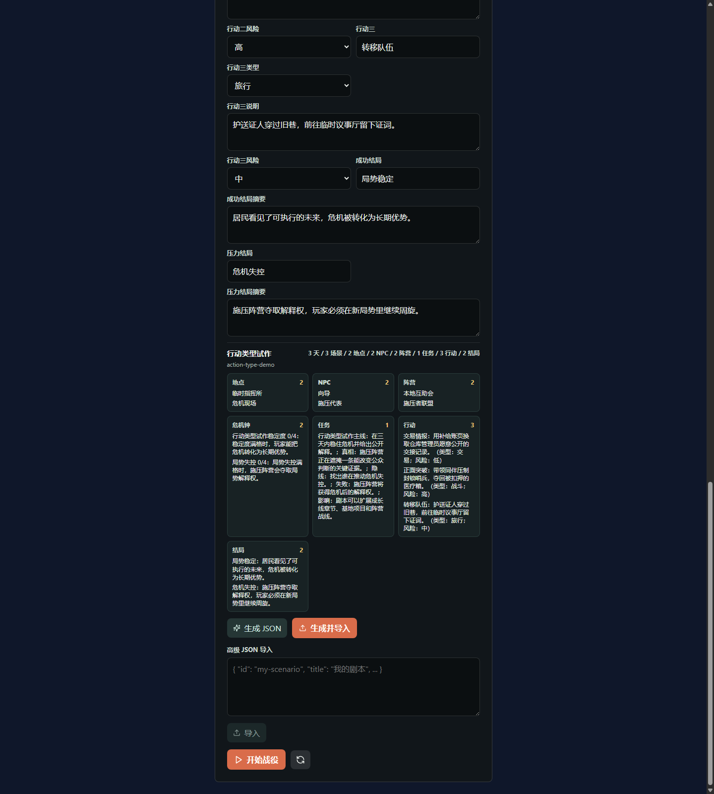

The screenshot was captured from a local runtime session after setting three different action types and verifying the creator preview reflected all three authored type labels.

### Verification

```bash
npm test -- packages/shared/src/creatorScenarioDraft.test.ts apps/web/src/creatorScenarioPreview.test.ts packages/content/src/creatorScenario.test.ts --reporter=dot
npm run typecheck
npm test -- --reporter=dot
npm run build
```

## 2026-06-08 - Creator Editable Action Risks

### Scope

- Added TDD coverage proving creator quick drafts can author each playable action's risk level instead of accepting the built-in action templates.
- Extended `CreatorScenarioDraftInput` with `primaryActionRiskLevel`, `secondaryActionRiskLevel`, and `tertiaryActionRiskLevel`; generated drafts and imported creator packages now preserve those values in `PlayerAction.riskLevel`.
- The creator GUI now exposes Chinese `行动一风险`, `行动二风险`, and `行动三风险` select controls, and the preview action section displays `行动名：说明（风险：低/中/高）` before import.

### Runtime Screenshot

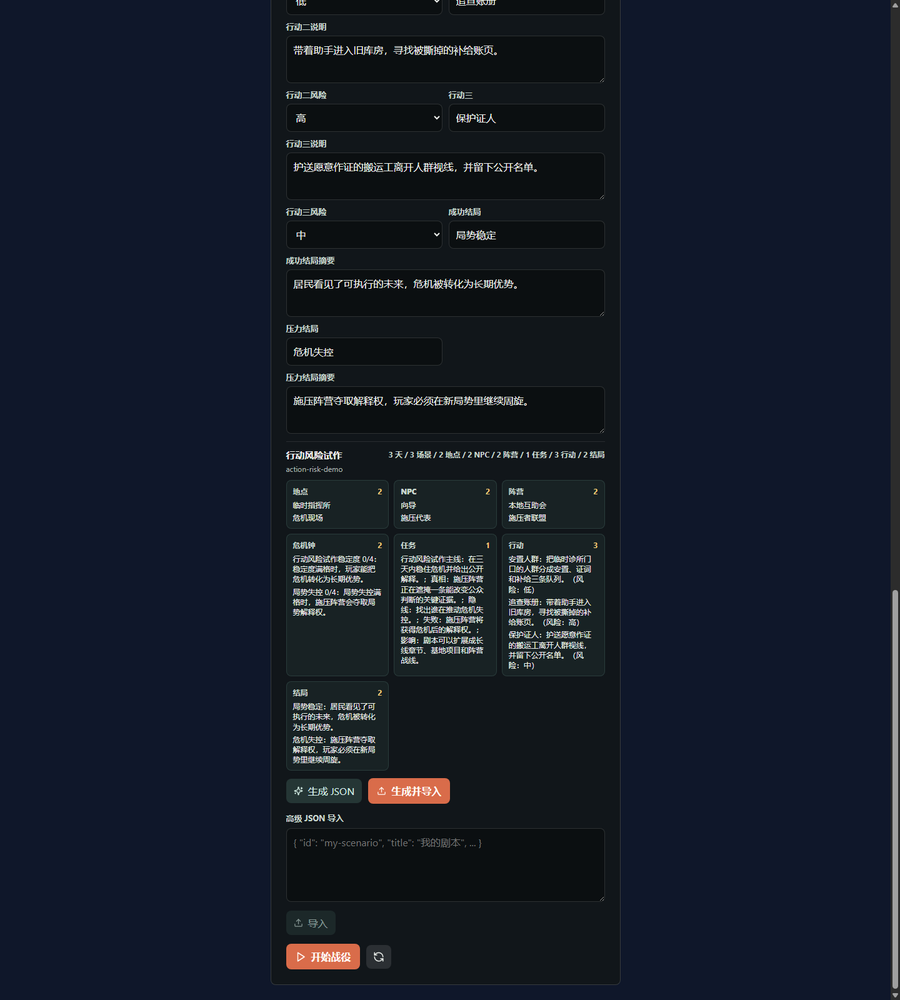

The screenshot was captured from a local runtime session after setting three different action risk levels and verifying the creator preview reflected all three authored risk labels.

### Verification

```bash
npm test -- packages/shared/src/creatorScenarioDraft.test.ts apps/web/src/creatorScenarioPreview.test.ts packages/content/src/creatorScenario.test.ts --reporter=dot
npm run typecheck
npm test -- --reporter=dot
npm run build
```

## 2026-06-08 - Creator Editable Action Descriptions

### Scope

- Added TDD coverage proving creator quick drafts can author each playable action's user-facing description instead of relying on fixed templates.
- Extended `CreatorScenarioDraftInput` with `primaryActionDescription`, `secondaryActionDescription`, and `tertiaryActionDescription`; generated drafts and imported creator packages now preserve those fields in `PlayerAction.description`.
- The creator GUI now exposes Chinese `行动一说明`, `行动二说明`, and `行动三说明` text areas, and the preview action section displays `行动名：说明` before import.

### Runtime Screenshot

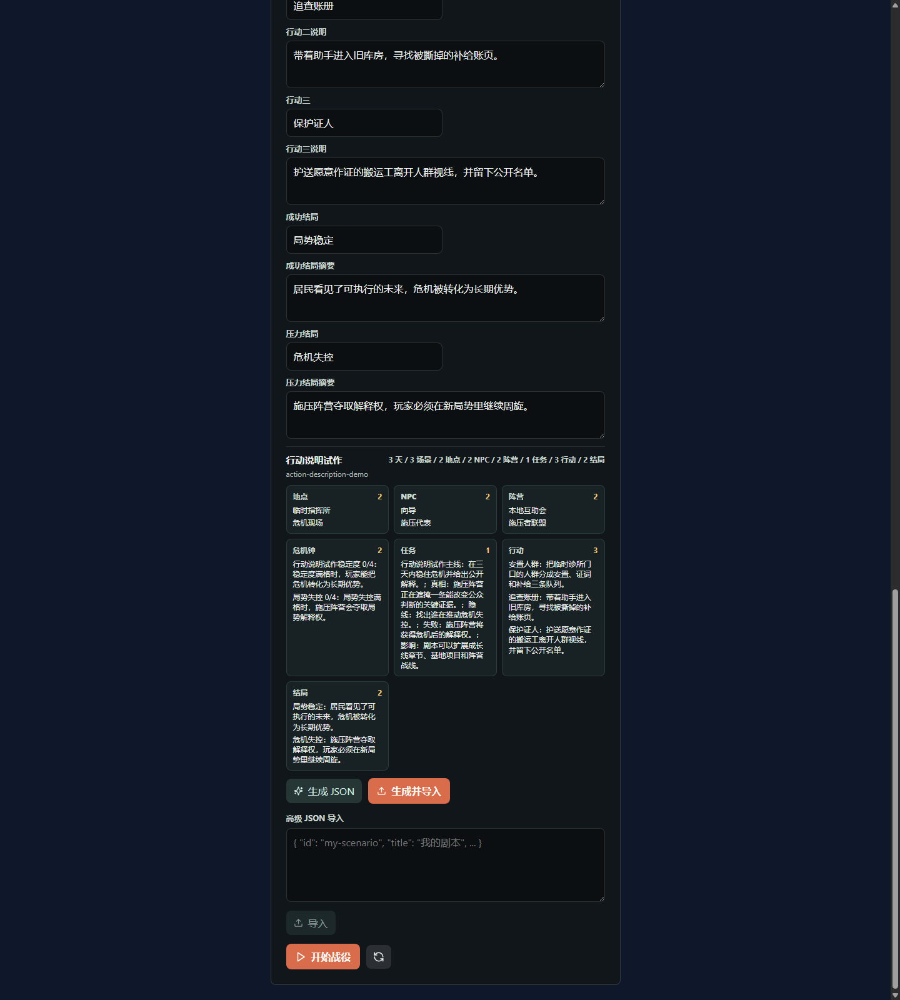

The screenshot was captured from a local runtime session after opening the scenario selection screen, filling three action descriptions, and verifying the creator preview reflected all three authored action descriptions.

### Verification

```bash
npm test -- packages/shared/src/creatorScenarioDraft.test.ts apps/web/src/creatorScenarioPreview.test.ts packages/content/src/creatorScenario.test.ts --reporter=dot
npm run typecheck
npm test -- --reporter=dot
npm run build
```

## 2026-06-08 - Creator Editable Quest Long-Term Impact

### Scope

- Added TDD coverage proving creator quick drafts can author the main quest's long-term impact instead of relying on a title-based expansion template.
- Extended `CreatorScenarioDraftInput` with `mainQuestLongTermImpact`; generated worlds and imported creator packages now preserve that authored text in `WorldState.quests[*].longTermImpact`.
- The creator GUI now exposes a Chinese `长期影响` text area, and the preview task section displays `任务目标；真相：背景；隐线：目标；失败：后果；影响：长期钩子` before import.

### Runtime Screenshot

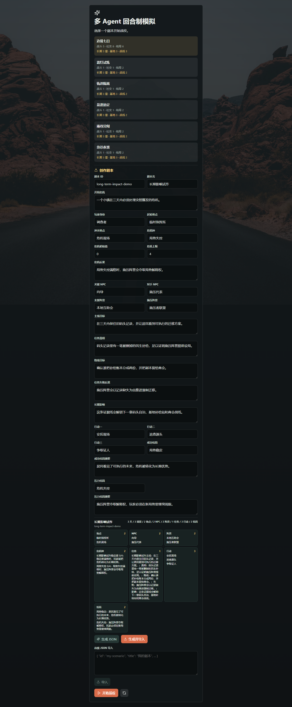

The screenshot was captured from a local runtime session after opening the scenario selection screen and verifying the creator panel showed the long-term impact field and the preview task section reflected the authored campaign hook.

### Verification

```bash
npm test -- packages/shared/src/creatorScenarioDraft.test.ts apps/web/src/creatorScenarioPreview.test.ts packages/content/src/creatorScenario.test.ts --reporter=dot
npm run typecheck
npm test -- --reporter=dot
npm run build
```

## 2026-06-08 - Creator Editable Quest Hidden Goals

### Scope

- Added TDD coverage proving creator quick drafts can author the main quest's hidden investigation goal instead of relying on a fixed template.
- Extended `CreatorScenarioDraftInput` with `mainQuestHiddenGoal`; generated worlds and imported creator packages now preserve that authored text in `WorldState.quests[*].hiddenGoal`.
- The creator GUI now exposes a Chinese `隐线目标` text area, and the preview task section displays `任务目标；真相：背景；隐线：目标；失败：后果` before import.

### Runtime Screenshot

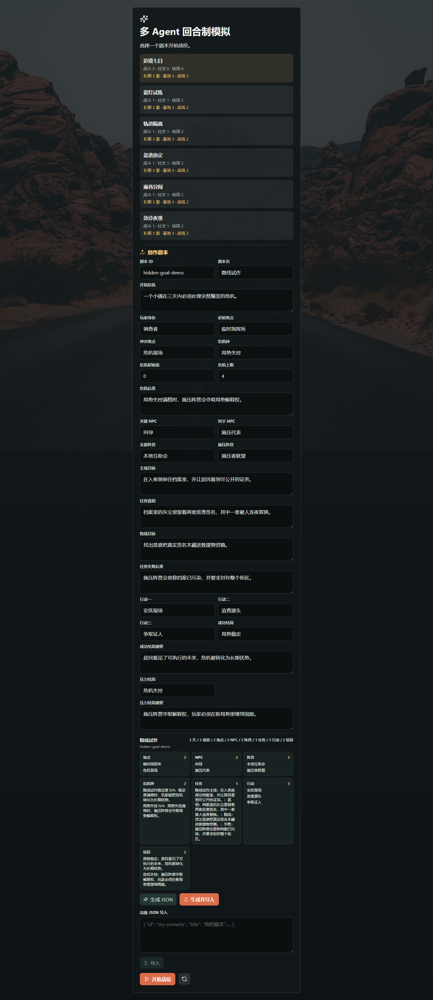

The screenshot was captured from a local runtime session after opening the scenario selection screen and verifying the creator panel showed the hidden-goal field and the preview task section reflected the authored hidden investigation direction.

### Verification

```bash
npm test -- packages/shared/src/creatorScenarioDraft.test.ts apps/web/src/creatorScenarioPreview.test.ts packages/content/src/creatorScenario.test.ts --reporter=dot
npm run typecheck
npm test -- --reporter=dot
npm run build
```

## 2026-06-08 - Creator Editable Quest Truth

### Scope

- Added TDD coverage proving creator quick drafts can author the main quest's true background instead of relying on a pressure-faction/crisis template.
- Extended `CreatorScenarioDraftInput` with `mainQuestRealBackground`; generated worlds and imported creator packages now preserve that authored text in `WorldState.quests[*].realBackground`.
- The creator GUI now exposes a Chinese `任务真相` text area, and the preview task section displays `任务目标；真相：背景；失败：后果` before import.

### Runtime Screenshot

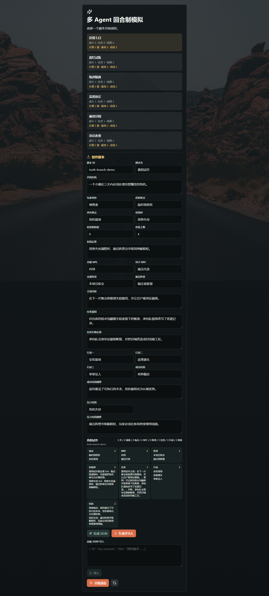

The screenshot was captured from a local runtime session after opening the scenario selection screen and verifying the creator panel showed the task truth field and the preview task section reflected the authored hidden background.

### Verification

```bash
npm test -- packages/shared/src/creatorScenarioDraft.test.ts apps/web/src/creatorScenarioPreview.test.ts packages/content/src/creatorScenario.test.ts --reporter=dot
npm run typecheck
npm test -- --reporter=dot
npm run build
```

## 2026-06-08 - Creator Editable Quest Failure Consequences

### Scope

- Added TDD coverage proving creator quick drafts can author the main quest's failure consequence instead of relying on a pressure-faction template.
- Extended `CreatorScenarioDraftInput` with `mainQuestFailureConsequence`; generated worlds and imported creator packages now preserve that authored text in `WorldState.quests[*].failureConsequence`.
- The creator GUI now exposes a Chinese `任务失败后果` text area, and the preview task section displays `任务目标；失败：后果` before import.

### Runtime Screenshot

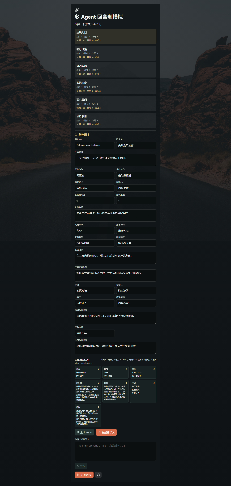

The screenshot was captured from a local runtime session after opening the scenario selection screen and verifying the creator panel showed the task failure consequence field and the preview task section reflected the authored failure branch.

### Verification

```bash
npm test -- packages/shared/src/creatorScenarioDraft.test.ts apps/web/src/creatorScenarioPreview.test.ts packages/content/src/creatorScenario.test.ts --reporter=dot
npm run typecheck
npm test -- --reporter=dot
npm run build
```

## 2026-06-08 - Creator Editable Main Quest Goal

### Scope

- Added TDD coverage proving creator quick drafts can author the main quest's player-facing objective instead of relying on a crisis-name template.
- Extended `CreatorScenarioDraftInput` with `mainQuestGoal`; generated worlds and imported creator packages now preserve that authored text in `WorldState.quests[*].surfaceGoal`.
- The creator GUI now exposes a Chinese `主线目标` text area, and the preview outline includes a `任务` section with the quest name and objective before import.

### Runtime Screenshot

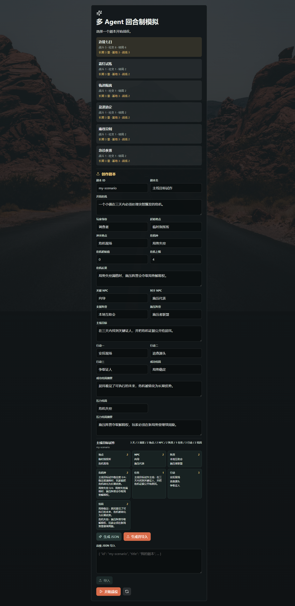

The screenshot was captured from a local runtime session after opening the scenario selection screen and verifying the creator panel showed the main quest goal field and the preview task section reflected the authored objective.

### Verification

```bash
npm test -- packages/shared/src/creatorScenarioDraft.test.ts apps/web/src/creatorScenarioPreview.test.ts packages/content/src/creatorScenario.test.ts --reporter=dot
npm run typecheck
npm test -- --reporter=dot
npm run build
```

## 2026-06-08 - Creator Editable Crisis Consequences

### Scope

- Added TDD coverage proving creator quick drafts can author the pressure crisis clock consequence, not only the crisis name and clock values.
- Extended `CreatorScenarioDraftInput` with `crisisConsequence`; generated worlds and imported creator packages now preserve that authored text in `WorldState.clocks[*].consequence`.
- The creator GUI now exposes a Chinese `危机后果` text area, and the preview crisis-clock section displays `当前/上限：后果` before import.

### Runtime Screenshot

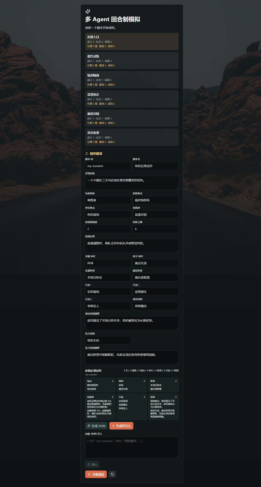

The screenshot was captured from a local runtime session after opening the scenario selection screen and verifying the creator panel showed the crisis consequence field and the preview clock list reflected the authored consequence text.

### Verification

```bash
npm test -- packages/shared/src/creatorScenarioDraft.test.ts apps/web/src/creatorScenarioPreview.test.ts packages/content/src/creatorScenario.test.ts --reporter=dot
npm run typecheck
npm test -- --reporter=dot
npm run build
```

## 2026-06-08 - Creator Editable Crisis Clock Values

### Scope

- Added TDD coverage proving creator quick drafts can set the crisis clock's initial progress and maximum value from GUI-backed fields.
- Extended `CreatorScenarioDraftInput` with `crisisInitialProgress` and `crisisMax`; generated worlds and imported creator packages now preserve those values on the pressure crisis clock.
- The creator GUI now exposes Chinese `危机初始值` and `危机上限` number inputs, and the preview crisis-clock section displays `当前/上限` values before import.

### Runtime Screenshot

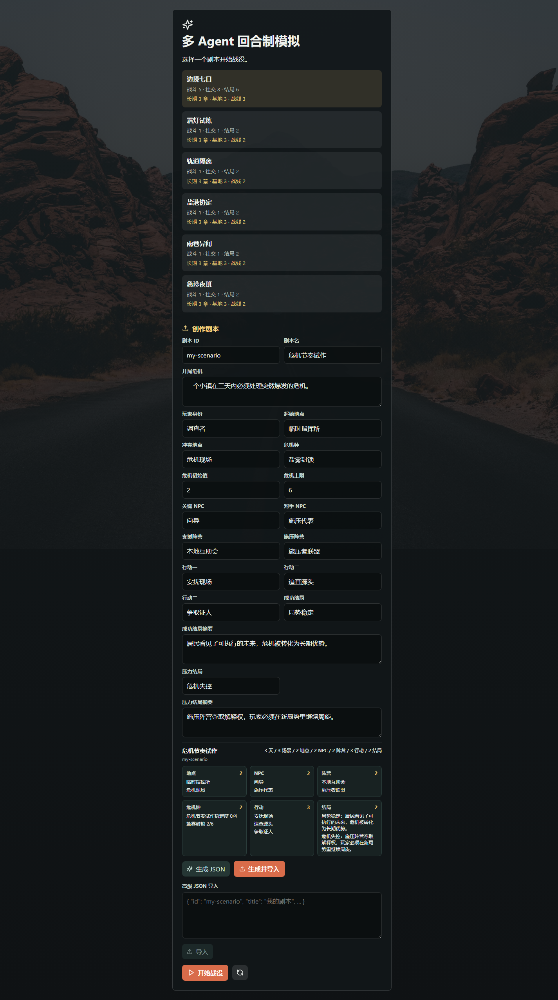

The screenshot was captured from a local runtime session after opening the scenario selection screen and verifying the creator panel showed both crisis clock number fields and the preview clock list reflected the authored `2/6` pressure clock.

### Verification

```bash
npm test -- packages/shared/src/creatorScenarioDraft.test.ts apps/web/src/creatorScenarioPreview.test.ts packages/content/src/creatorScenario.test.ts --reporter=dot
npm run typecheck
npm test -- --reporter=dot
npm run build
```

## 2026-06-08 - Creator Editable Ending Summaries

### Scope

- Added TDD coverage proving creator quick drafts can author the success and pressure ending summaries, not only the ending titles.
- Extended `CreatorScenarioDraftInput` with `successEndingSummary` and `pressureEndingSummary`; generated drafts and imported creator packages now preserve those authored summaries through `evaluateEnding`.
- The creator GUI now exposes Chinese `成功结局摘要` and `压力结局摘要` text areas, and the preview ending section shows `标题：摘要` so creators can inspect consequences before import.

### Runtime Screenshot

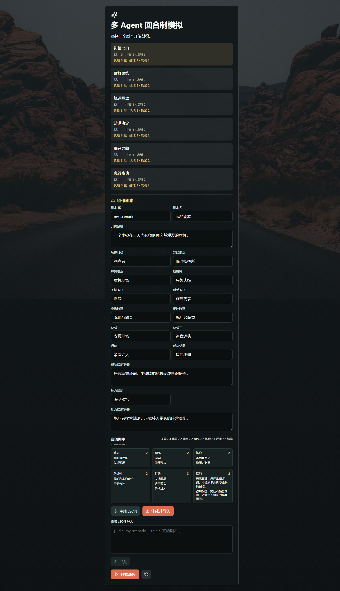

The screenshot was captured from a local runtime session after opening the scenario selection screen and verifying the creator panel showed both ending summary fields and the preview ending list included the authored consequence text.

### Verification

```bash
npm test -- packages/shared/src/creatorScenarioDraft.test.ts apps/web/src/creatorScenarioPreview.test.ts packages/content/src/creatorScenario.test.ts --reporter=dot
npm run typecheck
npm test -- --reporter=dot
npm run build
```

## 2026-06-08 - Creator Editable Ending Titles

### Scope

- Added TDD coverage proving creator quick drafts can name the success and pressure endings explicitly instead of deriving them only from the scenario title and crisis clock.
- Extended `CreatorScenarioDraftInput` with `successEndingTitle` and `pressureEndingTitle`; generated drafts, preview outlines, and imported creator packages now preserve those authored ending titles.
- The creator GUI now exposes Chinese `成功结局` and `压力结局` fields, while ending trigger conditions remain rule-owned through the imported scenario contract.

### Runtime Screenshot

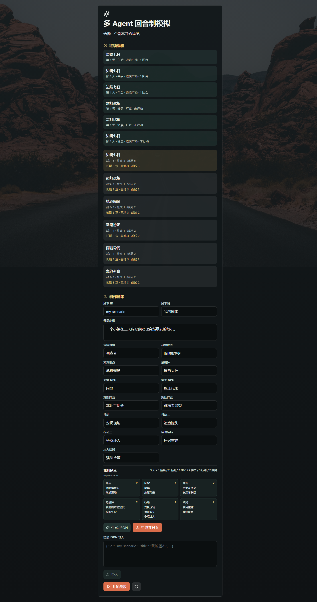

The screenshot was captured from a local runtime session after opening the scenario selection screen and verifying the creator panel showed `成功结局`, `压力结局`, and the preview ending list updated to the authored titles.

### Verification

```bash
npm test -- packages/shared/src/creatorScenarioDraft.test.ts apps/web/src/creatorScenarioPreview.test.ts packages/content/src/creatorScenario.test.ts --reporter=dot
npm run typecheck
npm test -- --reporter=dot
npm run build
```

## 2026-06-08 - Creator Editable Pressure Location

### Scope

- Added TDD coverage proving creator quick drafts can name the second/conflict location explicitly instead of deriving only `${crisisName}现场`.
- Extended `CreatorScenarioDraftInput` with `pressureLocationName`; generated worlds, preview outlines, action descriptions, scene names, and imported creator packages now preserve that authored location name.
- The creator GUI now exposes a Chinese `冲突地点` field between `起始地点` and `危机钟`, giving the quick-create path a clearer two-location scenario editor.

### Runtime Screenshot

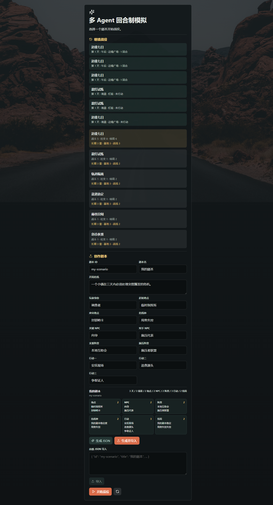

The screenshot was captured from a local runtime session after opening the scenario selection screen and verifying the creator panel showed `冲突地点`, default `危机现场`, and the preview location list included the authored conflict location name.

### Verification

```bash
npm test -- packages/shared/src/creatorScenarioDraft.test.ts apps/web/src/creatorScenarioPreview.test.ts packages/content/src/creatorScenario.test.ts --reporter=dot
npm run typecheck
npm test -- --reporter=dot
npm run build
```

## 2026-06-08 - Creator Editable Pressure NPC

### Scope

- Added TDD coverage proving creator quick drafts can name the opposing NPC explicitly instead of deriving only `${pressureFactionName}代表`.
- Extended `CreatorScenarioDraftInput` with `pressureNpcName`; generated worlds, preview outlines, and imported creator packages now preserve that authored NPC name.
- The creator GUI now exposes a Chinese `对手 NPC` field between `关键 NPC` and faction fields, giving the creator a clearer two-NPC cast editor.

### Runtime Screenshot

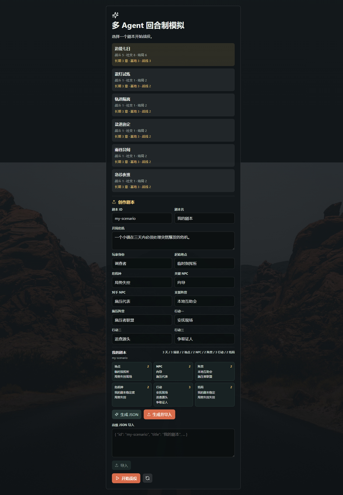

The screenshot was captured from a local runtime session after opening the scenario selection screen and verifying the creator panel showed `对手 NPC`, default `施压代表`, and the preview NPC list included the authored pressure NPC name.

### Verification

```bash
npm test -- packages/shared/src/creatorScenarioDraft.test.ts apps/web/src/creatorScenarioPreview.test.ts packages/content/src/creatorScenario.test.ts --reporter=dot
npm run typecheck
npm test -- --reporter=dot
npm run build
```

## 2026-06-08 - Creator Third Action Editor

### Scope

- Added TDD coverage proving the creator quick draft can define a third playable action, not just two fixed action cards.
- Extended `CreatorScenarioDraftInput` with `tertiaryActionLabel`; generated drafts now include a schema-valid `protect` action with referee-readable leverage tokens.
- The creator GUI now exposes a Chinese `行动三` field, and the draft preview counts and lists all three generated actions before import.
- The imported creator scenario package exposes the third action through the same `getActions` contract used by normal scenario play.

### Runtime Screenshot


The screenshot was captured from a local runtime session after opening the scenario selection screen and verifying the creator panel showed `行动三`, default `争取证人`, and the outline summary `3 行动` with all three playable action names.

### Verification

```bash
npm test -- packages/shared/src/creatorScenarioDraft.test.ts apps/web/src/creatorScenarioPreview.test.ts packages/content/src/creatorScenario.test.ts --reporter=dot
npm run typecheck
npm test -- --reporter=dot
npm run build
```

## 2026-06-08 - Creator Draft Outline Preview

### Scope

- Added a tested `buildCreatorDraftPreview` view model for creator scenario drafts.
- The creator GUI now renders a Chinese outline before import, summarizing generated days, scenes, locations, NPCs, factions, crisis clocks, actions, and endings.
- The preview is generated from the same schema-valid draft that will be exported/imported, so it reflects the actual playable scenario structure rather than a separate hand-written summary.

### Runtime Screenshot


The screenshot was captured from a local runtime session after opening the scenario selection screen and verifying the creator preview text contained `地点`, `NPC`, `阵营`, `危机钟`, `行动`, `结局`, and the summary `3 天 / 3 场景 / 2 地点 / 2 NPC / 2 阵营 / 2 行动 / 2 结局`.

### Verification

```bash
npm test -- apps/web/src/creatorScenarioPreview.test.ts apps/web/src/scenarioImport.test.ts --reporter=dot
npm run typecheck -w apps/web
npm run typecheck
npm test -- --reporter=dot
npm run build
```

## 2026-06-07 - Border Campaign Arc Chinese Text

### Scope

- Added TDD coverage for Border Seven Days campaign arc chapter text so the MVP scenario no longer exposes English chapter titles or focus copy through content metadata.
- Localized the three long-campaign arc chapters at source/API level: `边境危机`, `边境余波`, and `裂隙战线`.
- Updated API expectations for initial campaign creation and chapter-2 progression so the web Campaign Arc panel receives Chinese data without relying on a display-only fallback.

### Runtime Screenshot


The screenshot was captured from a local runtime session after opening a fresh Border Seven Days campaign and verifying the Campaign Arc panel showed `边境危机` plus Chinese focus text with the previous `Border Crisis` wording absent.

### Verification

```bash
npm test -- packages/content/src/scenarioRegistry.test.ts apps/api/src/server.test.ts --reporter=dot
npm run typecheck
npm test -- --reporter=dot
npm run build
```

## 2026-06-07 - Chinese Freeform Referee Feedback

### Scope

- Added TDD coverage proving freeform `custom` actions no longer emit English runtime referee feedback in core or API responses.
- The referee now labels inferred freeform channels in Chinese and records public chronicle events as `自由行动推进` or `自由行动受阻`.
- Public summaries and chronicle bodies explain that the referee converted the player's intent into legal state changes; player prose still cannot directly mutate world state.
- Freeform success and setback patch reasons are localized at the source so replay/debug surfaces do not depend on a web-only translation layer.

### Runtime Screenshot


The screenshot was captured from a local runtime session after opening a completed Chinese freeform action in the GUI and verifying the visible turn feedback showed `自由行动按“保护”推进` without old English phrases. The API/runtime probe for the same slice also verified the public chronicle event body includes `裁判将意图判定为`.

### Verification

```bash
npm test -- packages/core/src/core.test.ts apps/api/src/server.test.ts --reporter=dot
npm run typecheck
npm test -- --reporter=dot
npm run build
```

## 2026-06-07 - Creator Scenario Quick Draft GUI

### Scope

- Added a shared `buildCreatorScenarioDraft` helper that converts GUI fields into a deterministic creator scenario definition with a valid world state, scenes, day plans, actions, clocks, and two endings.
- Added tests proving the generated draft is schema-valid and can be accepted by the existing `importCreatorScenarioPackage` contract.
- Extended the scenario selection screen with a Chinese quick-create form for creator scenarios, while keeping the advanced JSON import/export path available.
- The quick-create import still posts to `/scenarios/import`, saves the returned definition locally, refreshes the scenario catalog, and selects the imported scenario.

### Runtime Screenshot


The screenshot was captured from a local runtime session after opening the scenario selection screen and verifying the new Chinese form fields and `生成 JSON` / `生成并导入` buttons render before the advanced JSON importer.

### Verification

```bash
npm test -- packages/shared/src/creatorScenarioDraft.test.ts packages/content/src/creatorScenario.test.ts apps/web/src/scenarioImport.test.ts --reporter=dot
npm run typecheck
npm test -- --reporter=dot
npm run build
```

## 2026-06-07 - Localized Expansion Content Text

### Scope

- Added a TDD content-localization acceptance test that walks every first-wave expansion package and rejects player-facing English prose in scenario titles, day plans, campaign arc text, locations, factions, NPCs, quests, clocks, actions, public events, and endings.
- Localized the cultivation package `霜灯试炼` at source level, including its day events, chapter arc, locations, factions, characters, quest, clocks, starting chronicle, fixed actions, and success/failure endings.
- Localized the generic expansion package factory and the science fiction, historical, urban supernatural, and realistic profession packages: `轨道隔离`, `盐港协定`, `雨巷异闻`, and `急诊夜班`.
- Updated API, content registry, and web campaign-arc tests so the scenario catalog and active campaign state expect Chinese text directly from content packages instead of relying only on display translation.

### Runtime Screenshot


The screenshot was captured from a local runtime session after creating a fresh `霜灯试炼` campaign and verifying the campaign title, current location, scene/event copy, and fixed action cards were Chinese source content.

### Verification

```bash
npm test -- packages/content/src/expansionLocalization.test.ts packages/content/src/scenarioRegistry.test.ts apps/api/src/server.test.ts apps/web/src/campaignArcStatus.test.ts --reporter=dot
npm run typecheck
npm test -- --reporter=dot
npm run build
```

## 2026-06-07 - Localized Action Cards and Chronicle Shell

### Scope

- Added a tested `displayPlayerAction` web display layer for built-in Border Seven Days scene actions, long-campaign replay labels, and first-wave expansion action labels.
- The main GUI action panel now renders localized action card titles and descriptions while still submitting the original `PlayerAction` payload to the referee.
- The chronicle timeline now uses Chinese turn titles, day/phase/location metadata, and confirmed-change summaries.
- Added common location ids such as `clinic`, `town_square`, and `black_market` to the shared display-label map.

### Runtime Screenshot


The screenshot was captured from a local runtime session after creating a fresh Frost Lantern Trial campaign and verifying the fixed action cards show Chinese text such as `穿过雾门` and `直面试炼灵` while the freeform composer remains available.

### Verification

```bash
npm test -- apps/web/src/playerActionDisplay.test.ts apps/web/src/chronicle.test.ts apps/web/src/displayLabels.test.ts --reporter=dot
npm run typecheck
npm test -- --reporter=dot
npm run build
```

## 2026-06-07 - Localized Expansion Scenario Titles

### Scope

- Added display-label coverage for the first-wave expansion scenario ids and common campaign chapter ids.
- `buildScenarioSelection` now renders known built-in scenario titles through the Chinese display-label layer while preserving unknown creator scenario titles as authored.
- `buildCampaignArcStatusSummary` now localizes known chapter ids, so the Campaign Arc panel can show Chinese chapter labels without changing API payload ids.
- Added focused tests for display labels, scenario picker options, fallback creator titles, and campaign arc chapter labels.

### Runtime Screenshot


The screenshot was captured from a local runtime session after opening the scenario picker and verifying `霜灯试炼`, `轨道隔离`, `盐港协定`, `雨巷异闻`, and `急诊夜班` appeared while the previous English expansion titles were absent from visible text.

### Verification

```bash
npm test -- apps/web/src/displayLabels.test.ts apps/web/src/scenarioSelection.test.ts apps/web/src/campaignArcStatus.test.ts --reporter=dot
npm run typecheck
npm test -- --reporter=dot
npm run build
```

## 2026-06-07 - Direct Freeform Submission

### Scope

- Added a tested freeform composer state helper so the GUI can distinguish blank text, selected custom text, and running turns.
- The freeform panel now shows Chinese `意图` / `风险` / `目标` chips instead of English `Intent` / `Risk` / `Target` labels.
- Added a `直接执行` button that submits the typed freeform `custom` action through the same `submitTurn` path as fixed actions, preserving the invariant that the referee owns all state changes.
- Kept the existing `加入本回合` path for players who want to stage the freeform action before using the main `执行回合` button.

### Runtime Screenshot


The screenshot was captured from a local runtime session after creating a fresh `border-seven-days` campaign, typing a Chinese freeform action, and verifying the action panel displayed Chinese preview chips plus the `直接执行` button without showing the previous English preview labels.

### Verification

```bash
npm test -- apps/web/src/freeformAction.test.ts --reporter=dot
npm run typecheck
npm test -- --reporter=dot
npm run build
```

## 2026-06-07 - In-game LLM Connection Check

### Scope

- Added `POST /llm/test` so the web client can validate a locally configured OpenAI-compatible provider before spending a turn.
- The endpoint creates a temporary LLM client from request-level settings, asks for a compact structured JSON response, and returns only non-secret metadata such as model, base URL, latency, and status message.
- The LLM settings panel now includes a Chinese `测试` button, `测试中` running state, and Chinese success/error feedback. API keys remain masked in the input and are not echoed in the response or status text.
- Structured API errors are parsed into readable UI messages instead of raw JSON blobs.
- Added a shared display-label layer for dynamic campaign ids and resources, so long-campaign choices, scenario arc summaries, faction plans, inherited assets, reputation tags, and Agent transparency details render in Chinese instead of leaking internal ids such as `missing_caravan`, `old_outpost`, or `public_case_archive`.

### Runtime Screenshot


The screenshot was captured from a local runtime session after creating a fresh `border-seven-days` campaign, opening the LLM settings panel, pressing `测试` with no API key configured, and verifying the GUI displayed `LLM 连接失败：请输入 API Key 后再测试连接。` without exposing any secret.

### Verification

```bash
npm test -- apps/api/src/server.test.ts apps/web/src/api.test.ts apps/web/src/llmSettings.test.ts --reporter=dot
npm run typecheck
npm test -- --reporter=dot
npm run build
```

## 2026-06-07 - Campaign Asset Project Moves

### Scope

- Added a tested asset-project table for inherited long-campaign assets.
- `POST /campaigns/:id/campaign/progress` now rejects unknown or unowned asset projects before creating a progression turn.
- Valid asset projects consume one owned base asset, shift campaign faction fronts, append a public chronicle event, and persist the result as a referee-owned patch.
- The web Campaign Moves panel now derives asset moves from current campaign state so ending rewards become usable strategic choices.

### Runtime Screenshot


The screenshot was captured from a local runtime session after a real `guild_case` playthrough inherited `public_case_archive x1`, resumed the campaign, and displayed `Mobilize public case archive` as an actionable Campaign Move.

### Verification

```bash
npm test -- packages/core/src/campaignProgression.test.ts apps/api/src/server.test.ts apps/web/src/campaignProgression.test.ts --reporter=dot
npm run typecheck
npm test -- --reporter=dot
npm run build
```

## 2026-06-07 - Freeform Player Actions

### Scope

- Added `custom` to the shared `PlayerActionSchema` so arbitrary player intent can be submitted through the same turn endpoint as fixed actions.
- Added a web freeform action composer beside fixed action cards. The player can type any action, select it, and execute the turn through the normal GUI flow.
- The core referee adjudicates custom actions with the same deterministic 2d6 path, emits legal `StatePatch` changes, and records public freeform outcomes without treating player prose as direct state mutation.
- Added deterministic intent inference for freeform text. The helper emits `freeform:intent:*`, `freeform:risk:*`, and `freeform:target:*` tokens, the GUI previews them as chips, and the referee uses those tokens to pick the matching rule channel.

### Runtime Screenshot


The screenshot was captured from a local runtime session after creating a fresh `border-seven-days` campaign, typing a freeform Chinese action into the GUI composer, selecting it, and verifying the unified execute button stayed available.


The screenshot was captured from a local runtime session after typing an open-ended escort action and verifying the GUI displayed inferred intent, risk, and target chips before execution. The current direct-submit slice above localizes those preview chips into Chinese.

### Verification

```bash
npm test -- packages/shared/src/schemas.test.ts packages/core/src/core.test.ts apps/api/src/server.test.ts apps/web/src/freeformAction.test.ts --reporter=dot
npm test -- apps/web/src/freeformAction.test.ts packages/core/src/core.test.ts apps/api/src/server.test.ts --reporter=dot
npm run typecheck
npm test -- --reporter=dot
npm run build
```

## 2026-06-05 - Ending Consequence Assets

### Scope

- Added a tested consequence table for all 6 Border Seven Days terminal endings.
- Each inherited ending now unlocks a distinct long-campaign base asset and shifts one or more faction-war fronts through referee-owned `StatePatch` records.
- The web long-campaign dashboard now lists inherited campaign assets alongside facilities, chapter XP, and faction-front pressure.

### Runtime Screenshot


The screenshot was captured from a local runtime session after a real `guild_case` playthrough reached `guild_reform`, then `/campaigns/:id/campaign/progress` advanced the game into chapter 2 and displayed `public_case_archive x1` in the long-campaign panel.

### Verification

```bash
npm test -- packages/core/src/campaignProgression.test.ts apps/api/src/server.test.ts apps/web/src/campaignProgression.test.ts --reporter=dot
npm run typecheck
npm test -- --reporter=dot
npm run build
```

## 2026-06-03 - Ending Legacy Continuation

### Scope

- Added a tested bridge from terminal MVP endings into post-MVP long campaign play.
- Long campaign referee patches can now record `ending:<id>` legacy flags, grant campaign XP, append a public ending memory, and advance from the finished crisis into the next chapter.
- The API now derives the current scenario ending server-side before `/campaigns/:id/campaign/progress`, so clients do not need to invent or submit ending identities.

### Runtime Screenshot


The report keeps a verified runtime screenshot inline as requested. This continuation slice extends the same campaign dashboard path by turning a finished MVP ending into persistent chapter history for the long game.

### Verification

```bash
npm test -- packages/core/src/campaignProgression.test.ts apps/api/src/server.test.ts --reporter=dot
npm run typecheck
npm test -- --reporter=dot
npm run build
```

## 2026-06-03 - API Full Campaign Endings

### Scope

- Added a public API acceptance test for all 6 Border Seven Days deterministic MVP ending routes.
- Each route creates a campaign, repeatedly calls `POST /campaigns/:id/turns/run`, reaches day 7 night, and verifies the expected ending in both `scenarioStatus` and the final turn resolution.
- The same test proves API persistence records stay replayable: chronicle replay length matches completed turns, snapshots include the initial state plus every turn result, and the final replay patch remains referee-owned.

### Runtime Screenshot


The report keeps a verified runtime screenshot inline as requested. This API acceptance slice proves the dashboard-backed campaign surface is supported by complete server-side playthrough and replay records for every MVP ending.

### Verification

```bash
npm test -- apps/api/src/server.test.ts --reporter=dot
npm run typecheck
npm test -- --reporter=dot
npm run build
```

## 2026-06-03 - Faction Outcome Matrix

### Scope

- Added a focused TDD matrix proving all 3 Border Seven Days factions have advance, blocked, and redirected plan outcomes.
- Added referee-owned branches for old outpost evidence blocking the Frontier Guild, black-market ledger exposure redirecting Blackstone Consortium, and defeating Eve disrupting the Rift Cult ritual route.
- Kept the invariant intact: faction plans and resources still change only through `StatePatch` records produced by the referee.

### Runtime Screenshot


The report keeps a verified runtime screenshot inline as requested. This rules slice powers the same faction-plan dashboard surface by ensuring each visible faction plan can meaningfully change direction after player choices.

### Verification

```bash
npm test -- packages/core/src/factions.test.ts --reporter=dot
npm run typecheck
npm test -- --reporter=dot
npm run build
```

## 2026-06-03 - Player Visible State Redaction

### Scope

- Added a focused visibility test for player-facing world state.
- Proved all 6 Border Seven Days locations retain public information while hiding `hiddenInfo`.
- Extended redaction to quest true backgrounds and hidden goals so API-visible state does not reveal referee-only truth before discovery.

### Runtime Screenshot


The report keeps a verified runtime screenshot inline as requested. This backend visibility slice protects the same campaign dashboard surface by ensuring player-facing API state cannot expose hidden scenario truth.

### Verification

```bash
npm test -- packages/core/src/visibility.test.ts --reporter=dot
npm run typecheck
npm test -- --reporter=dot
npm run build
```

## 2026-06-03 - MVP Scene Resolution Coverage

### Scope

- Added executable scene action fixtures for all Border Seven Days combat and social MVP scenes.
- Added acceptance coverage for 5 combat scenes and 8 social scenes through the full `runTurn` pipeline.
- Each covered scene now proves three invariants: Agent proposals exist, state changes enter through the referee `state_patch`, and a public result is appended for player feedback.

### Runtime Screenshot


The report keeps a verified runtime screenshot inline as requested. This content/backend slice strengthens the playable scene coverage behind the same campaign dashboard and turn-resolution flow.

### Verification

```bash
npm test -- packages/agents/src/playthrough.test.ts --reporter=dot
npm run typecheck
npm test -- --reporter=dot
npm run build
```

## 2026-06-03 - Key NPC Proposal Coverage

### Scope

- Added a regression test proving the normal orchestrator can activate every Border Seven Days key NPC across representative MVP routes.
- Expanded active Agent selection for clinic, black market, old outpost, mine, and chapel scenes so Mina and White Crow participate in LLM proposal generation instead of staying content-only records.
- Filtered active Agent ids against the current world's character table so expansion packs do not receive unrelated Border Seven Days actors.

### Runtime Screenshot


The report keeps a verified runtime screenshot inline as requested. This backend Agent slice supports the same playable dashboard: the visible scenes and faction surfaces now have proposal coverage from all 10 important NPCs behind the turn-resolution flow.

### Verification

```bash
npm test -- packages/agents/src/orchestrator.test.ts --reporter=dot
npm run typecheck
npm test -- --reporter=dot
npm run build
```

## 2026-06-03 - Agent Observation Boundary

### Scope

- Added a regression test around NPC LLM prompt construction.
- NPC observations now include the actor faction's public strategy context so proposals can respond to faction pressure.
- The prompt whitelist excludes location `hiddenInfo`, faction `hiddenGoal`, and character `secret` strings, preserving the rule that Agents act only on what they can know.

### Runtime Screenshot


The report keeps a verified runtime screenshot inline as requested. This backend Agent safety slice protects the same dashboard surface: public faction plans may be shown to players and NPCs, while hidden faction goals remain available only to referee/debug paths.

### Verification

```bash
npm test -- packages/agents/src/orchestrator.test.ts --reporter=dot
```

## 2026-06-03 - Faction Plan Visibility

### Scope

- Added a tested web view model for visible faction plans, leaders, public clock pressure, and strongest resources.
- Added a dashboard Faction Plans panel so players can see what the Frontier Guild, Blackstone Consortium, and Rift Cult are currently trying to do.
- Kept the rule invariant intact: the UI only summarizes world state already produced by referee-owned patches.

### Runtime Screenshot


The screenshot was captured from a local runtime session after creating a fresh `border-seven-days` campaign. It shows the new Faction Plans panel alongside crisis clocks, relationships, LLM settings, and Agent transparency.

### Verification

```bash
npm test -- apps/web/src/factionPlans.test.ts --reporter=dot
npm test -- apps/web/src/factionPlans.test.ts apps/web/src/campaignProgression.test.ts apps/web/src/api.test.ts --reporter=dot
npm run typecheck
npm test -- --reporter=dot
npm run build
```

## 2026-06-03 - Long Campaign Progress Legality

### Scope

- Added API-side legality checks before long-campaign progression can create a turn, referee patch, snapshot, chronicle event, or memory log.
- Invalid completed quests, base facilities, training skills, and faction fronts now return `invalid_campaign_progression` with a concrete reason.
- Preserved the core invariant: long campaign state still changes only through valid referee-owned `state_patch` records.

### Runtime Screenshot


The report keeps a runtime screenshot inline as requested. This slice protects the same long-campaign dashboard and Campaign Moves surface by rejecting requests that reference scenario hooks or world-state entries the current campaign does not expose.

### Verification

```bash
npm test -- apps/api/src/server.test.ts --reporter=dot
npm run typecheck
npm test -- --reporter=dot
npm run build
```

## 2026-06-03 - Long Campaign Move Choices

### Scope

- Added tested web view-model support for long-campaign move choices: base-building, training, and faction-front stabilization.
- Connected the dashboard to submit those choices through the existing `/campaigns/:id/campaign/progress` API, so each move still resolves through referee-owned `state_patch` records.
- Kept the long campaign expansion path replayable: returned state, scenario status, available actions, narration, and chronicle are refreshed after each move.

### Runtime Screenshot


The report keeps a runtime screenshot inline as requested. This slice extends the same long-campaign dashboard surface with actionable Campaign Moves; behavior is covered by focused UI view-model/API tests and the full build gate below.

### Verification

```bash
npm test -- apps/web/src/campaignProgression.test.ts apps/web/src/api.test.ts --reporter=dot
npm run typecheck
npm test -- --reporter=dot
npm run build
```

## 2026-06-03 - OpenAI-compatible LLM Token Budget

### Scope

- Added a validated `maxTokens` field to the shared LLM configuration contract, with browser-local persistence and API per-turn override support.
- Passed the token budget into the OpenAI-compatible chat completion request as `max_tokens`, covering DeepSeek-compatible base URLs and models without provider-specific code.
- Added an opt-in real-provider smoke test that reads credentials only from environment variables.
- Kept API keys out of world state, replay payloads, queue persistence, and documentation.

### Runtime Screenshot


The report continues to include a verified runtime screenshot inline. This LLM configuration slice is validated by focused tests and the full gate; the screenshot remains the current captured runtime surface for the web dashboard.

### Verification

```bash
npm test -- packages/agents/src/llm.test.ts apps/web/src/llmSettings.test.ts apps/web/src/api.test.ts apps/api/src/server.test.ts --reporter=dot
npm run test:llm:smoke
npm run typecheck
npm test -- --reporter=dot
npm run build
```

## 2026-06-02 - Active Campaign Arc Status

### Scope

- Added active campaign arc status to campaign payloads: current chapter number, current chapter details, unlocks, base facilities, and faction fronts.
- Added a web Campaign Arc panel that summarizes the active chapter focus after the player enters a campaign.
- Kept the existing invariant intact: this is derived scenario/package status and does not mutate world state outside referee-owned patches.

### Runtime Screenshot


The report keeps a runtime screenshot inline as requested. This stored capture remains the current verified runtime image for the long-campaign dashboard surface; the active Campaign Arc slice is covered by API and web view-model tests plus the build gate below.

### Verification

```bash
npm test -- apps/api/src/server.test.ts apps/web/src/campaignArcStatus.test.ts --reporter=dot
npm run typecheck
npm test -- --reporter=dot
npm run build
```

## 2026-06-02 - Long Campaign API and UI

### Scope

- Added a tested API endpoint, `POST /campaigns/:id/campaign/progress`, for referee-owned long campaign progression.
- Persisted long campaign progression as normal state snapshots, replay entries, chronicle events, and memory logs.
- Added a web dashboard panel that summarizes chapter, campaign XP, base facilities, and faction-war fronts.
- Kept the invariant intact: long campaign state changes still enter the world only through a referee `state_patch`.

### Runtime Screenshot


The screenshot was captured from a local `npm run dev` session after creating a `border-seven-days` campaign and applying a real `/campaign/progress` request with a base investment and faction front update.

### Verification

```bash
npm run typecheck
npm test -- --reporter=dot
npm run build
```

### Notes

- The full-page runtime capture is also stored at `docs/screenshots/long-campaign-progress-2026-06-02.png`.
- The focused panel screenshot is the report image because it clearly shows the new long campaign UI state.
